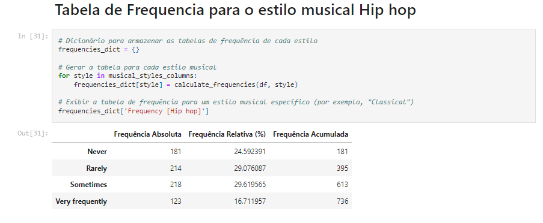
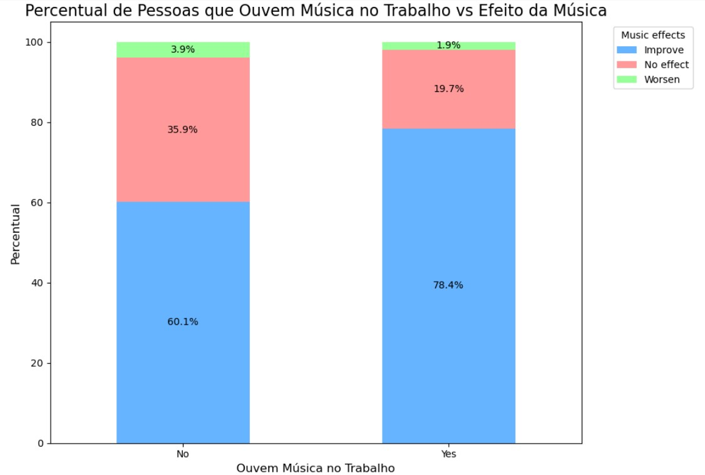
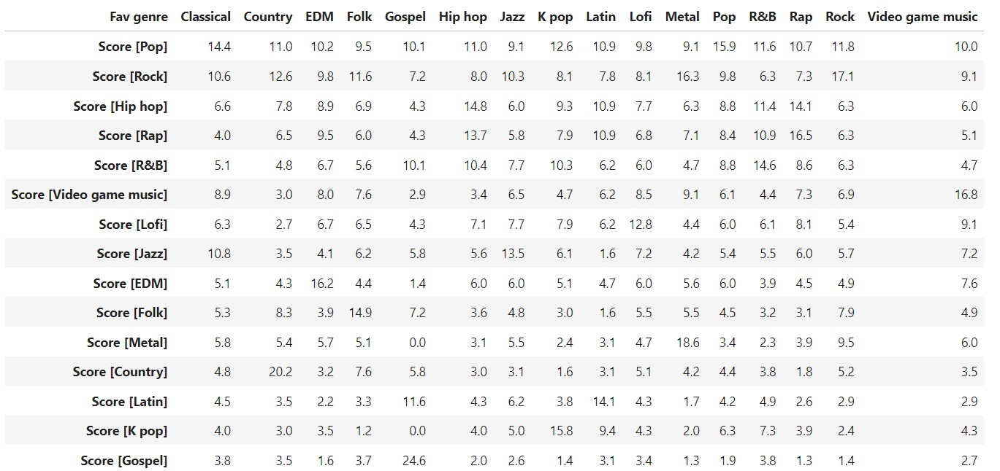

# Conhecendo os dados

<!-- Nesta seção, deverá ser registrada uma detalhada análise descritiva e exploratória sobre a base de dados selecionada na Etapa 1 com o objetivo de compreender a estrutura dos dados, detectar eventuais _outliers_ e também, avaliar/detectar as relações existentes entre as variáveis analisadas.

Para isso, sugere-se que sejam utilizados cálculos de medidas de tendência central, como média, mediana e moda, para entender a centralidade dos dados; sejam exploradas medidas de dispersão como desvio padrão e intervalos interquartil para avaliar a variabilidade dos dados; sejam utilizados gráficos descritivos como histogramas e box plots, para representar visualmente as características essenciais dos dados, pois essas visualizações podem facilitar a identificação de padrões e anomalias; sejam analisadas as relações entre as variáveis por meio de análise de correlação, gráficos de dispersões, mapas de calor, entre outras técnicas. 

Inclua nesta seção, gráficos, tabelas e demais artefatos que você considere relevantes para entender os dados com os quais você irá trabalhar.  Além disso, inclua e comente os trechos de código mais relevantes desenvolvidos para realizar suas análises. Na pasta "src", inclua o código fonte completo. -->

**Parte 1: Análise exploratória e descritiva da base de dados sobre o efeito da música nos transtornos mentais**

O primeiro passo para iniciar a análise exploratória e descritiva da base de dados foi importar as bibliotecas necessárias. Em seguida, importamos a base de dados contida no arquivo .csv e realizamos a contagem total de linhas e colunas presentes na base.

Após, foi determinado que fosse retornado todos os nomes das colunas existentes na base de dados.

Com o intuito de identificar se todos as colunas e linhas estavam sendo retornadas de forma correta, retornamos as 5 primeiras linhas da base de dados.

Na imagem abaixo, pode ser identificado a quantidade de valores nulos em cada coluna. 

Para facilitar a identificação dos valores nulos de forma para eficaz, foi construindo um gráfico de barras com as colunas que possuem valores nulos.

A coluna "Permissions" foi excluída, pois não será utilizada em nossa análise. Em seguida, foi realizada a análise das principais estatísticas descritivas, com o objetivo de compreender a distribuição dos dados e identificar possíveis outliers.

A análise descritiva dos dados revela que a idade média dos participantes é de 25 anos, com uma variação considerável (desvio padrão de 12,05 anos). Os indivíduos escutam música em média 3,57 horas por dia, mas há outliers, como pessoas reportando até 24 horas de escuta. A variável de batimentos por minuto (BPM) também apresenta um valor anômalo extremo (1e+09), sugerindo erros nos dados.

As variáveis relacionadas a transtornos mentais, como ansiedade, depressão, insônia e OCD, têm uma média baixa e pouca variação, indicando uma prevalência ou gravidade moderada na amostra. Outliers foram detectados em algumas variáveis (como BPM e horas de escuta).

Para uma análise visual desse dados, realizamos a construção de alguns gráficos "Box-Plot", podemos considerar esse visual eficaz para visualizar rapidamente a distribuição e os outliers dos dados. 

Age (Idade): A distribuição da idade está concentrada entre 18 e 35 anos, com alguns outliers acima de 50 anos e até 89 anos. A mediana está em torno de 25 anos. 
Hours per day (Horas por dia): A maioria dos participantes escuta música por até 5 horas diárias, com vários outliers acima desse valor, incluindo indivíduos reportando até 24 horas, o que pode ser um erro de coleta de dados.
BPM (Batimentos por minuto): O gráfico confirma a presença de um valor outlier extremo (1e+09), que claramente é um erro.
Anxiety (Ansiedade), Depression (Depressão), Insomnia (Insônia) e OCD: Para essas variáveis relacionadas a transtornos mentais, as distribuições estão concentradas nas faixas mais baixas (de 0 a 5), com poucas ocorrências extremas. Isso sugere que, na maior parte da amostra, os transtornos são leves ou moderados.

Tendo em vista que a partir do Box-Plot foi identificado que a idade concentrada está entre 18 e 35 anos, foi realizado um histograma para melhor visualização a respeito dos dados. Identicamos a presença de um público idoso na base de dados, mas a predominância é do público jovem, conforme imagem abaixo:

Tendo em vista que o público maior está entre os jovens e há alguns outliers na coluna "Hours per day", fizemos uma breve análise desses dados, que confirmam as conclusões acima.

Foram criadas tabelas de frequência para cada gênero musical, além de uma análise da frequência com que as pessoas escutam de cada gênero (Never, Rarely, Sometimes, Very Frequently). Essas tabelas são essenciais para entender a distribuição dos dados, proporcionando insights sobre a popularidade de cada categoria e a frequência de consumo.

Tabela de Frequencia por estilo musical Classical

Tabela de Frequencia por estilo musical Country

Tabela de Frequencia por estilo musical EDM

Tabela de Frequencia por estilo musical Folk

Tabela de Frequencia por estilo musical Gospel

Tabela de Frequencia por estilo musical Hip Hop

Tabela de Frequencia por estilo musical Jazz

Tabela de Frequencia por estilo musical K Pop

Tabela de Frequencia por estilo musical Latin

Tabela de Frequencia por estilo musical Lo Fi

Tabela de Frequencia por estilo musical Metal

Tabela de Frequencia por estilo musical Pop

Tabela de Frequencia por estilo musical R&B

Tabela de Frequencia por estilo musical Rap

Tabela de Frequencia por estilo musical Rock

Como as pessoas escutam musicas em plataformas distintas realizamos um cálculos e plotamos o resultado em um gráfico para identificar a média de horas por dia para cada plataforma. 

Por fim, foi realizada uma análise de correlação entre as váriaveis da base de dados. A análise de correlação de variáveis é fundamental porque ela ajuda a identificar o grau de associação entre duas ou mais variáveis. Com isso, é possível entender se e como as variáveis se movem juntas, o que pode fornecer insights valiosos para tomada de decisão, modelagem preditiva e otimização de processos. 

Ao analisar a correlação, podemos identificar se as variáveis estão positivamente correlacionadas (à medida que uma aumenta, a outra também tende a aumentar), negativamente correlacionadas (à medida que uma variável aumenta, a outra tende a diminuir) ou não correlacionadas (as variações em uma variável não fornecem informações sobre o comportamento da outra).

A correlação, no entanto, não implica causalidade, ou seja, mesmo que duas variáveis estejam correlacionadas, isso não significa necessariamente que uma causa a outra.

A partir da Matriz podemos identificar os níveis das correlações, conforme imagem abaixo:

A análise mostra correlações significativas entre as variáveis relacionadas à saúde mental, especialmente entre ansiedade, depressão e insônia, sugerindo que essas condições podem coexistir. O TOC também está relacionado de maneira moderada a essas variáveis, indicando que pode fazer parte de um quadro mais amplo de saúde mental. Horas por dia e BPM parecem não ter uma relação significativa com as variáveis psicológicas.

**Parte 2: Análise quantitativa da base dados para a pesquisa sobre o impacto da música sobre transtornos**

**Tabela de dados:** tab_musicaesaude_r.xlsx  
**Arquivo Jupyter (python):** Analise_MusicaeSaude_r.jpynb  

* **Gráfico 1**: Indica a representatividade dos participantes por faixa etária,  indicando que a maioria dos participantes são adolescentes e adultos abaixo dos 30 anos.
* **Gráfico 2**: Indica a representatividade dos pesquisados por streaming utilizado,  indicando que mais da metade dos participantes consome música através do Spotify, seguido do Youtube e de quem não utiliza serviço de streaming de música.

**Trecho do código:**  
 file_path = 'tab_musicaesaude.xlsx' 
df = pd.read_excel(file_path, sheet_name='musicaesaude') 
faixas_idade = pd.cut(df['Age'], bins=[10, 20, 30, 40, 50, 60],  
                      labels=['10-20', '20-30', '30-40', '40-50', '50-60']) 
faixa_idade_counts = faixas_idade.value_counts() 
streaming_counts = df['Primary streaming service'].value_counts()  
  
* **Gráfico 3**: Compara as avaliações sobre o efeito da música em relação a quem trabalho ouvindo música e quem não trabalha ouvindo música. Indicando maior percepção de impacto positivo da música nas pessoas que trabalham ouvindo música.
  

**Trecho do código:**  
 file_path = 'tab_musicaesaude.xlsx'  
df = pd.read_excel(file_path, sheet_name='musicaesaude')  
while_working_effects = df.groupby(['While working', 'Music effects']).size().unstack(fill_value=0)  
while_working_percent = while_working_effects.div(while_working_effects.sum(axis=1), axis=0) * 100  
ax = while_working_percent.plot(kind='bar', stacked=True, figsize=(10, 7), color=['#66b3ff', '#ff9999', '#99ff99', '#ffcc99'])  
  
* **Gráfico 4**: Indica a representatividade das pessoas que avaliam a música como benéfica relacionado ao seu genêro de música favorito. Indicando que as pessoas com maior aceitação sobre o benefício da música são as que indicaram como gênero favorito música Gospel e Lofi.
  

**Trecho do código:**  
 file_path = 'tab_musicaesaude.xlsx'  
df = pd.read_excel(file_path, sheet_name='musicaesaude')  
improve_data = df[df['Music effects'] == 'Improve']  
genre_improve_counts = improve_data['Fav genre'].value_counts()  
genre_total_counts = df['Fav genre'].value_counts()  
genre_improve_percent = (genre_improve_counts / genre_total_counts) * 100  
ax = genre_improve_percent.plot(kind='bar', figsize=(10, 7), color='#66b3ff')  
  
* **Gráfico 5**: O gráfico indica a percepção dos pesquisados sobre o efeito da música comparado ao nível de ansiedade. Indicando que pessoas que se classificaram com ansiedade tendem a sentir mais o efeito positivo da música.
* **Gráfico 6**: O gráfico indica a percepção dos pesquisados sobre o efeito da música comparado ao nível de depressão. Indicando que pessoas que se classificaram com depressão tendem a sentir mais o efeito positivo da música.
  

**Trecho do código:**  
 file_path = 'tab_musicaesaude.xlsx'  
df = pd.read_excel(file_path, sheet_name='musicaesaude')  
anxiety_counts = df['Anxiety_level'].value_counts()  
depression_counts = df['Depression_level'].value_counts()  
insomnia_counts = df['Insomnia_level'].value_counts()  
ocd_counts = df['OCD_level'].value_counts()  
music_effects = df['Music effects'].value_counts()  
anxiety_effects = df.groupby('Anxiety_level')['Music effects'].value_counts(normalize=True).unstack(fill_value=0)  
depression_effects = df.groupby('Depression_level')['Music effects'].value_counts(normalize=True).unstack(fill_value=0)  
insomnia_effects = df.groupby('Insomnia_level')['Music effects'].value_counts(normalize=True).unstack(fill_value=0)  
ocd_effects = df.groupby('OCD_level')['Music effects'].value_counts(normalize=True).unstack(fill_value=0)  
  
* **Gráfico 7**: O gráfico indica a percepção dos pesquisados sobre o efeito da música comparado ao nível de insônia. Indicando que pessoas que se classificaram com insônia tendem a sentir um pouco mais o efeito positivo da música.
* **Gráfico 8**: O gráfico indica a percepção dos pesquisados sobre o efeito da música comparado ao nível de TOC. Indicando que pessoas que se classificaram com TOC tendem a sentir um pouco mais o efeito positivo da música.
  

**Trecho do código:**  
 file_path = 'tab_musicaesaude.xlsx'  
df = pd.read_excel(file_path, sheet_name='musicaesaude')  
anxiety_counts = df['Anxiety_level'].value_counts()  
depression_counts = df['Depression_level'].value_counts()  
insomnia_counts = df['Insomnia_level'].value_counts()  
ocd_counts = df['OCD_level'].value_counts()  
music_effects = df['Music effects'].value_counts()  
anxiety_effects = df.groupby('Anxiety_level')['Music effects'].value_counts(normalize=True).unstack(fill_value=0)  
depression_effects = df.groupby('Depression_level')['Music effects'].value_counts(normalize=True).unstack(fill_value=0)  
insomnia_effects = df.groupby('Insomnia_level')['Music effects'].value_counts(normalize=True).unstack(fill_value=0)  
ocd_effects = df.groupby('OCD_level')['Music effects'].value_counts(normalize=True).unstack(fill_value=0)  
   
* **Gráfico 9**: O gráfico indica os usuários que sinalizaram ter impacto positivo da música relacionando com aos estilos musicais ouvidos com maior frequência. Destaque para Rock e Pop que foram os estilos mais ouvidos por quem percebeu melhoria.
    * Para esta análise se tornar quantitativa foi atribuído um modelo score de acordo com a classificação textual de frequência de consumo de cada estilo musical. 
    * Score: Nunca - 0, Raramente - 1, As vezes - 2, Frequentemente - 3.
  

**Trecho do código:**  
 file_path = 'tab_musicaesaude.xlsx'   
df = pd.read_excel(file_path, sheet_name='musicaesaude') 
df_improve = df[df['Music effects'] == 'Improve'] 
score_columns = [ 
    'Score [Country]', 'Score [EDM]', 'Score [Folk]', 'Score [Gospel]', 'Score [Hip hop]', 
    'Score [Jazz]', 'Score [K pop]', 'Score [Latin]', 'Score [Lofi]', 'Score [Metal]',  
    'Score [Pop]', 'Score [R&B]', 'Score [Rap]', 'Score [Rock]', 'Score [Video game music]' 
    ] 
effects_by_genre = df_improve.groupby('Music effects')[score_columns].sum()  
total_scores = effects_by_genre.sum(axis=1)  
effects_percent = (effects_by_genre.T / total_scores).T * 100  
  
* **Tabela 1**: A tabela abaixo exibe os estilos musicais indicados como favoritos e compara com os estilos que de fato foram mais consumidos pelos usuários. Comprovando que embora os usuários estivessem classificado um gênero como favorito, na prática ouvem frequentemente outros estilos musicais.
     * Para esta análise se tornar quantitativa foi atribuído um modelo score de acordo com a classificação textual de frequência de consumo de cada estilo musical.
     * Score: Nunca - 0, Raramente - 1, As vezes - 2, Frequentemente - 3.
  

**Trecho do código:**  
 columns_of_interest = [ 
    'Fav genre', 'Score [Country]', 'Score [EDM]', 'Score [Folk]', 'Score [Gospel]',  
    'Score [Hip hop]', 'Score [Jazz]', 'Score [K pop]', 'Score [Latin]',  
    'Score [Lofi]', 'Score [Metal]', 'Score [Pop]', 'Score [R&B]',  
    'Score [Rap]', 'Score [Rock]', 'Score [Video game music]' 
] 
df_selected = df[columns_of_interest] 
grouped_scores = df_selected.groupby('Fav genre').mean() 
percentage_scores = grouped_scores.apply(lambda x: 100 * x / x.sum(), axis=1) 
inverted_percentage_scores = percentage_scores.transpose() 
inverted_percentage_scores = inverted_percentage_scores.round(1)  

## Descrição dos achados

<!-- A partir da análise descrita e exploratória realizada, descreva todos os achados considerados relevantes para o contexto em que o trabalho se insere. Por exemplo: com relação à centralidade dos dados algo chamou a atenção? Foi possível identificar correlação entre os atributos? Que tipo de correlação (forte, fraca, moderada)? -->

**Parte 1: Insigths da análise exploratória e descritiva da base de dados sobre o efeito da música nos transtornos mentais**

**A partir da tabela com os dados da estatística descritiva, alguns insigths foram gerados: (Isabela)**

  * Média (mean): A idade média dos participantes é de aproximadamente 25 anos. Eles escutam música, em média, cerca de 3,57 horas por dia. A média para ansiedade, depressão, insônia e OCD é relativamente baixa, o que pode indicar uma baixa frequência geral de alta gravidade desses transtornos na amostra.

  * Desvio Padrão (std): O desvio padrão é relativamente alto em algumas variáveis, como a idade (12,05 anos) e os batimentos por minuto (3,98e+07), o que sugere uma grande variação entre os participantes.

  * Mínimo e Máximo: Um aspecto interessante é o valor máximo de BPM, que chega a 1e+09, o que é fisicamente impossível e provavelmente representa um erro nos dados. Além disso, a variável de "Hours per day" mostra que algumas pessoas relataram escutar música por até 24 horas, o que também pode ser uma anomalia ou erro de registro. Esses valores são indicativos de outliers.

  * Quartis (25%, 50%, 75%): A distribuição das variáveis relacionadas aos transtornos mentais mostra que a maioria dos participantes se encontra em níveis baixos de gravidade, já que os valores até o 75º percentil estão muito próximos do mínimo possível, sugerindo uma baixa prevalência ou severidade na amostra.
  
  * Há clara evidência da existencia de outliers  nas colunas "BPM" e "Hours per day" devendo estes serem tratados posteriormente.

    Com base na Análise de Correlação de Person em relação "Hours per day" e os transtorno metais, podemos observar o seguinte:
    
  *  Anxiety e Depression: Há uma correlação moderada positiva de 0,52, indicando que pessoas que relatam altos níveis de ansiedade também tendem a apresentar níveis mais elevados de depressão. Isso pode sugerir uma coexistência entre esses dois transtornos.
    
  *  Depression e Insomnia: A correlação de 0,38 sugere que a depressão está associada a problemas de insônia, o que é consistente com a literatura médica que indica uma forte relação entre distúrbios do sono e transtornos depressivos.
    
  *  Anxiety e OCD: A correlação de 0,35 indica que pessoas com níveis mais elevados de ansiedade também tendem a relatar mais sintomas de transtorno obsessivo-compulsivo.

  *  Insomnia e Anxiety: A correlação de 0,29 revela que a insônia pode estar moderadamente ligada à ansiedade.

  *   Hours per day e transtornos mentais: Não há correlações significativas entre o número de horas que as pessoas escutam música e os transtornos mentais. As correlações variam entre 0,05 e 0,14, o que sugere que o consumo de música, ao menos em termos de horas por dia, não parece estar fortemente relacionado à gravidade dos transtornos investigados.

  Em relação ao uso das plataformas, a plataforma que mais possui média de horas escutadas é o Spotify, seguido do Apple music e em terceiro o Youtube Music, essas são três principais ferramentas utilizadas.

  Com base na Análise de Correlação das váriaveis das bases, entendemos que:

  * Há uma correlação positiva forte entre Ansiedade e Depressão (valor de 0,5), sugerindo que pessoas com altos níveis de ansiedade tendem a apresentar altos níveis de depressão. Isso indica uma relação potencialmente significativa entre essas condições psicológicas.
    
  * A Insônia tem uma correlação positiva moderada tanto com Ansiedade (0,3) quanto com Depressão (0,4). Isso sugere que pessoas que sofrem de ansiedade ou depressão também podem ter dificuldades de sono (insônia). Essas relações fazem sentido, já que distúrbios psicológicos costumam estar associados a problemas no sono.

  * O OCD também mostra correlações positivas com Ansiedade (0,3), Depressão (0,2) e Insônia (0,2). Embora as correlações sejam moderadas, isso pode indicar que o TOC está relacionado a esses outros fatores psicológicos.

  * O tempo gasto diariamente (presumivelmente em alguma atividade específica) não tem uma correlação significativa com as outras variáveis, com correlações muito próximas de 0. Isso sugere que o número de horas dedicado à atividade em questão (talvez estudo ou trabalho) não está fortemente relacionado com os níveis de ansiedade, depressão, BPM (batimentos por minuto) ou outras variáveis de saúde mental e física.

  * O BPM (frequência cardíaca) não parece estar fortemente correlacionado com as variáveis psicológicas ou comportamentais, já que seus valores de correlação com todas as outras variáveis estão próximos de 0, o que sugere uma relação fraca ou inexistente.

  * A Idade tem correlações muito baixas com as demais variáveis, indicando que nesta análise a idade não é um fator fortemente relacionado com ansiedade, depressão, insônia, TOC, BPM ou o tempo gasto na atividade.

    Com base na tabela de frequencia geral do estilos musicias, extraimos os seguintes insights:

  * O gênero Rock aparece como o mais popular, com uma frequência absoluta de 188, representando 25,54% da amostra total. Isso indica que o Rock é o gênero mais ouvido ou preferido entre os respondentes.Pop vem logo em seguida, com uma frequência relativa de 15,49%. O fato de que esses dois gêneros somam mais de 40% do total acumulado sugere uma forte preferência por gêneros musicais mais tradicionais ou populares.

  * Metal (11,99%) e Classical (7,20%) também aparecem com uma quantidade considerável de ouvintes, somando quase 20% quando considerados juntos.Video game music, EDM e R&B estão em uma faixa intermediária, com percentuais entre 4% e 6%, o que sugere que, embora não sejam os mais populares, ainda têm uma base significativa de fãs.

  * A distribuição entre outros gêneros, como Hip hop, Folk, K-pop, Country, entre outros, mostra que há uma grande diversidade de preferências musicais, ainda que a maioria dessas categorias tenha uma representação menor (abaixo de 5%).Rap, Jazz e Lofi têm uma representação menor, mas ainda relevante dentro da diversidade de gostos musicais.

  * Gêneros como Gospel e Latin aparecem nas últimas posições, com as menores frequências absolutas, representando menos de 1% cada, o que indica que são menos populares entre os respondentes desta amostra.

  * A frequência acumulada mostra que, ao atingir os primeiros 4 gêneros (Rock, Pop, Metal, Classical), já se cobre mais de 60% das preferências. Isso indica uma concentração de gostos em um pequeno número de gêneros, enquanto os demais têm menor representatividade individual.
  

**Parte 2: Insights da análise quantitativa da base dados para a pesquisa sobre o impacto da música sobre transtornos**

  Com base na análise dos dados e também dos gráficos e tabelas gerados, foi possível concluir os seguintes pontos. 
  
  * A maioria dos participantes são adolescentes e adultos abaixo dos 30 anos.  
  
  * Mais da metade dos participantes consome música através do Spotify, seguido do Youtube e de quem não utiliza serviço de streaming de música. 
  
  * Pessoas que trabalham ouvindo música tendem a perceber mais impacto positivo da música. 
  
  * 100% das pessoas que tem como estilo musical favorito o Gospel e o Lofi avaliaram a música como benéfica. Porém na sequência da análise é possível verificar que não necessariamente essas pessoas ouvem apenas o seu estilo musical favorito. 
  
  * Através dos gráficos 5, 6, 7 e 8 é possível perceber que pessoas que se classificam com algum transtorno tendem a perceber mais o impacto positivo da música. 
  
  * Através do gráfico 9 é possível perceber que Rock e Pop que foram os estilos mais ouvidos por quem percebeu melhoria. 
  
  * Foi possível perceber também que pessoas que possuem outros estilos músicais como favorito (Ex: Gospel) também ouvem com frequência estilos como Rock e Pop.

## Ferramentas utilizadas
<!-- Existem muitas ferramentas diferentes que podem ser utilizadas para fazer a análise dos dados. Nesta seção, descreva as ferramentas/tecnologias utilizadas e sua aplicação. Vale destacar que, preferencialmente, as análises deverão ser realizadas utilizando a linguagem de programação Python. -->

**Ferramentas utilizadas:**
  * Análise exploratória inicial: Excel  
  * Base de dados: csv  
  * Ferramenta para análise, construção de gráficos e tabelas: Jupyter Notebook  
  * Linguagem utilizada: Python 
  * IDE: VS Code

