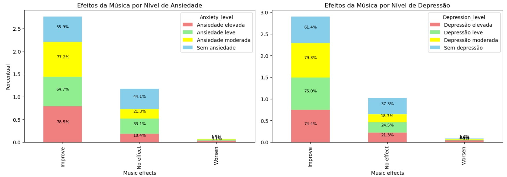

# Conhecendo os dados

Nesta seção, deverá ser registrada uma detalhada análise descritiva e exploratória sobre a base de dados selecionada na Etapa 1 com o objetivo de compreender a estrutura dos dados, detectar eventuais _outliers_ e também, avaliar/detectar as relações existentes entre as variáveis analisadas.

Para isso, sugere-se que sejam utilizados cálculos de medidas de tendência central, como média, mediana e moda, para entender a centralidade dos dados; sejam exploradas medidas de dispersão como desvio padrão e intervalos interquartil para avaliar a variabilidade dos dados; sejam utilizados gráficos descritivos como histogramas e box plots, para representar visualmente as características essenciais dos dados, pois essas visualizações podem facilitar a identificação de padrões e anomalias; sejam analisadas as relações entre as variáveis por meio de análise de correlação, gráficos de dispersões, mapas de calor, entre outras técnicas. 

Inclua nesta seção, gráficos, tabelas e demais artefatos que você considere relevantes para entender os dados com os quais você irá trabalhar.  Além disso, inclua e comente os trechos de código mais relevantes desenvolvidos para realizar suas análises. Na pasta "src", inclua o código fonte completo.

**(Renan)**
**Análise exploratória da base dados e criação de insights para a pesquisa sobre o impacto da música sobre transtornos**
* Gráfico 1: Indica a representatividade dos participantes por faixa etária,  indicando que a maioria dos participantes são adolescentes e adultos abaixo dos 30 anos.
* Gráfico 2: Indica a representatividade dos pesquisados por streaming utilizado,  indicando que mais da metade dos participantes consome música através do Spotify, seguido do Youtube e de quem não utiliza serviço de streaming de música.

* Gráfico 3: Compara as avaliações sobre o efeito da música em relação a quem trabalho ouvindo música e quem não trabalha ouvindo música. Indicando maior percepção de impacto positivo da música nas pessoas que trabalham ouvindo música.
  

* Gráfico 4: Indica a representatividade das pessoas que avaliam a música como benéfica relacionado ao seu genêro de música favorito. Indicando que as pessoas com maior aceitação sobre o benefício da música são as que indicaram como gênero favorito música Gospel e Lofi.
  

* Gráfico 5: O gráfico indica a percepção dos pesquisados sobre o efeito da música comparado ao nível de ansiedade. Indicando que pessoas que se classificaram com ansiedade tendem a sentir mais o efeito positivo da música.
* Gráfico 6: O gráfico indica a percepção dos pesquisados sobre o efeito da música comparado ao nível de depressão. Indicando que pessoas que se classificaram com depressão tendem a sentir mais o efeito positivo da música.
  

* Gráfico 6: O gráfico indica a percepção dos pesquisados sobre o efeito da música comparado ao nível de insônia. Indicando que pessoas que se classificaram com insônia tendem a sentir um pouco mais o efeito positivo da música.
* Gráfico 7: O gráfico indica a percepção dos pesquisados sobre o efeito da música comparado ao nível de TOC. Indicando que pessoas que se classificaram com TOC tendem a sentir um pouco mais o efeito positivo da música.
  

* Gráfico 8: O gráfico indica a percepção dos pesquisados sobre o efeito da música comparado ao nível de TOC. Indicando que pessoas que se classificaram com TOC tendem a sentir um pouco mais o efeito positivo da música.
  

## Descrição dos achados

A partir da análise descrita e exploratória realizada, descreva todos os achados considerados relevantes para o contexto em que o trabalho se insere. Por exemplo: com relação à centralidade dos dados algo chamou a atenção? Foi possível identificar correlação entre os atributos? Que tipo de correlação (forte, fraca, moderada)? 

## Ferramentas utilizadas

Existem muitas ferramentas diferentes que podem ser utilizadas para fazer a análise dos dados. Nesta seção, descreva as ferramentas/tecnologias utilizadas e sua aplicação. Vale destacar que, preferencialmente, as análises deverão ser realizadas utilizando a linguagem de programação Python.

  * **(Renan) Ferramentas utilizadas:**
    * Análise exploratória inicial: Excel
    * Base de dados: csv
    * Ferramenta para construção de gráficos e tabelas: Jupyter Notebook
    * Linguagem utilizada: Python

