# CASO 1 - Árvore de Decisão - Túlio

# Preparação dos dados
Para a prepação dos dados que serão utilizados no modelo, utilizamos os passos a seguir:

## Limpeza dos dados
Realizamos a limpeza dos valores ausentes na coluna 'Music effects'

```
data_clean = data.dropna(subset=['Music effects'])
```

## Codificacao dos dados
Realizamos o mapeamento da variável alvo 'Music effects' para incluir o 'Worsen" e codificando os valores 'Improve', 'No effect' e 'Worsen' para 1, 0 e -1, respectivamente.

```
data_clean['Music effects'] = data_clean['Music effects'].map({'Improve': 1, 'No effect': 0, 'Worsen': -1})
```

## Variáveis consideradas para treinamento do modelo
Para realizar o treinamento e teste do modelo, considerando o que esperamos no nosso output, utilizamos as variáveis X e y, onde X contém as colunas de frequência dos gêneros, colunas das doenças mentais e a idade e y contém os efeitos da musica no tratamento.

```
X = data[style_columns + ['Anxiety', 'Depression', 'Insomnia', 'OCD', 'Age']]
y = data['Music effects']
```

## Separação dos dados 
Para o treinamento e teste do modelo, separamos os dados em 70% do dataset para treinamento e 30% para testes do modelo.

```
X_train, X_test, y_train, y_test = train_test_split(X, y, test_size=0.3, random_state=42)
```

# Descrição dos modelos
## Árvore de Decisão
O algoritmo Arvore de Decisão(Decision Tree) foi escolhido, pois é uma abordagem simples, eficiente e intuitiva para modelar o impacto da música na saúde mental, oferecendo boa interpretabilidade e capacidade de capturar padrões complexos sem a necessidade de suposições rígidas ou tratamentos iniciais elaborados. Elas representam um bom ponto de partida para explorar os dados e compreender as principais variáveis que influenciam os efeitos da música.
Alguns dos principais motivos para a escolha por árvore de descisão:
1. Interpretação clara: Árvores de decisão são fáceis de entender e interpretar. Cada divisão na árvore representa uma regra baseada nos dados, permitindo identificar como diferentes variáveis influenciam os resultados.

2. Lida com dados heterogêneos: Elas podem trabalhar com variáveis contínuas e categóricas sem a necessidade de transformações complexas, o que é especialmente útil neste problema, onde os dados incluem frequências de escuta de música e condições psicológicas.

3. Identificação de padrões relevantes: Árvores de decisão podem capturar relações não-lineares e interações entre variáveis de forma automática. Isso é importante em um problema como este, onde os efeitos da música podem depender de combinações de fatores (por exemplo, um gênero específico impactar mais em casos de ansiedade elevada).

4. Flexibilidade: Árvores de decisão funcionam bem com problemas de classificação multiclasses, como este, sem exigir alterações substanciais nos dados ou na modelagem.

5. Não requer suposições: Diferentemente de modelos estatísticos como a regressão logística, árvores de decisão não fazem suposições sobre a distribuição dos dados ou a linearidade das relações, o que as torna mais versáteis para problemas com relações complexas entre variáveis.

Para a construção do modelo, foi realizado a importação das seguintes bibliotecas e o dataset foi carregado em memória pelo pandas.

```
import pandas as pd
import numpy as np
import matplotlib.pyplot as plt
import seaborn as sns
from sklearn.model_selection import train_test_split, GridSearchCV
from sklearn.tree import DecisionTreeClassifier, plot_tree
from sklearn.metrics import accuracy_score, classification_report, confusion_matrix

file_path = 'C:/Users/tulio/Downloads/dados_tratados_V2.csv'
data = pd.read_csv(file_path, delimiter=';')
```

No trecho de código a seguir, fazemos o carregamento de algumas informações do dataset

```
print(data.head())
print(data.info())
```

O trecho a seguir é responsável por armazenar a frequencia dos estilos musicais e a relação entre frequência dos gêneros musicais e o efeitos no tratamento
```
style_columns = [col for col in data.columns if 'frequency' in col]
data[style_columns].hist(bins=15, figsize=(15, 10))
plt.show()

# Relação entre frequência de gêneros musicais e "Music effects"
sns.countplot(x='Music effects', data=data)
plt.show()
```

Aqui é feito a limpeza e codificação dos dados e também é definido as variáveis X e y
```
data_clean = data.dropna(subset=['Music effects'])
data_clean['Music effects'] = data_clean['Music effects'].map({'Improve': 1, 'No effect': 0, 'Worsen': -1})

X = data[style_columns + ['Anxiety', 'Depression', 'Insomnia', 'OCD', 'Age']]
y = data['Music effects']
```

Neste trecho é feito a separação dos dados para teste e treinamento
```
X_train, X_test, y_train, y_test = train_test_split(X, y, test_size=0.3, random_state=42)
```

Fazemos a definição de parâmetros que serão utilizados na criação do modelo

```
param_grid = {
    'criterion': ['gini', 'entropy'],
    'max_depth': [5, 10, 15, 20, None],
    'min_samples_split': [2, 10, 20],
    'min_samples_leaf': [1, 5, 10]
}
```

Após a aplicação da limpeza, codificação dos dados, definição das variáveis e parâmetros seguimos para a criação do modelo

```
grid_search = GridSearchCV(DecisionTreeClassifier(random_state=42), param_grid, cv=5, scoring='accuracy')
grid_search.fit(X_train, y_train)
best_model = grid_search.best_estimator_
```
Após a predição do modelo, segue para o cálculo das métricas de qualidade e os melhores parâmtetros

```
y_pred = best_model.predict(X_test)
print("Acurácia:", accuracy_score(y_test, y_pred))
print(classification_report(y_test, y_pred))

print("Melhores parâmetros:", grid_search.best_params_)
```
Após a análise das métricas de qualidade, é feito a visualização da árvore de decisão

```
plt.figure(figsize=(25, 15))
plot_tree(best_model, feature_names=X.columns, class_names=['Worsen', 'Improve', 'No effect'], filled=True)
plt.show()
```

> [!NOTE]
> Verifique o código do modelo no link abaixo
> [Arvore de Decisao](https://github.com/ICEI-PUC-Minas-PMV-SI/pmv-si-2024-2-pe7-t1-musicaesaudemental/blob/main/src/decision-tree-classifier.ipynb)


### Árvore de Decisão com Undersampling
Nesta abordagem, a técnica de undersampling foi usada para balancear as classes no conjunto de treino, reduzindo o número de amostras na classe majoritária para igualar o número de amostras das classes minoritárias.
Apesar de reduzir o impacto do desbalanceamento sem criar dados sintéticos, mantendo a integridade dos dados reais, essa abordagem pode apresentar algumas limitações, que são:
- Perda de informações na classe majoritária, o que pode limitar o desempenho geral do modelo.
- Em problemas com poucos dados, a remoção de amostras pode comprometer a capacidade de generalização.

Para a construção do modelo, foram importadas as bibliotecas necessárias e o dataset foi carregado em memória usando o pandas.
```
import pandas as pd
import numpy as np
import matplotlib.pyplot as plt
import seaborn as sns
from sklearn.model_selection import train_test_split, GridSearchCV
from sklearn.tree import DecisionTreeClassifier, plot_tree
from sklearn.metrics import accuracy_score, classification_report, confusion_matrix
from imblearn.under_sampling import RandomUnderSampler  # Undersampling

file_path = 'C:/Users/tulio/Downloads/dados_tratados_V2.csv'
data = pd.read_csv(file_path, delimiter=';')
```

O trecho de código a seguir é responsável por carregar algumas informações básicas do dataset

```
print(data.head())
print(data.info())
```

Neste trecho, são exploradas a distribuição dos estilos musicais e a relação entre a frequência de gêneros musicais e os efeitos percebidos.
```
style_columns = [col for col in data.columns if 'frequency' in col]
data[style_columns].hist(bins=15, figsize=(15, 10))
plt.show()

sns.countplot(x='Music effects', data=data)
plt.show()
```

Aqui é feito a limpeza e codificação dos dados e também é definido as variáveis X e y
```
data_clean = data.dropna(subset=['Music effects'])

data_clean['Music effects'] = data_clean['Music effects'].map({'Improve': 1, 'No effect': 0, 'Worsen': -1})

X = data[style_columns + ['Anxiety', 'Depression', 'Insomnia', 'OCD', 'Age']]
y = data['Music effects']
```

Como as classes estavam desbalanceadas, utilizamos RandomUnderSampler para realizar um balanceamento das amostras.
```
undersampler = RandomUnderSampler(random_state=42)
X_resampled, y_resampled = undersampler.fit_resample(X, y)
```

Neste trecho é feito a separação dos dados para teste e treinamento
```
X_train, X_test, y_train, y_test = train_test_split(X, y, test_size=0.3, random_state=42)
```

Fazemos a definição de parâmetros que serão utilizados na criação do modelo
```
param_grid = {
    'criterion': ['gini', 'entropy'],
    'max_depth': [5, 10, 15, 20, None],
    'min_samples_split': [2, 10, 20],
    'min_samples_leaf': [1, 5, 10]
}
```

Após a aplicação da limpeza, codificação dos dados, definição das variáveis e parâmetros seguimos para a criação do modelo
```
model = DecisionTreeClassifier(random_state=42)
grid_search = GridSearchCV(model, param_grid, cv=5, scoring='accuracy')
grid_search.fit(X_train, y_train)

best_model = grid_search.best_estimator_
print("Melhores parâmetros:", grid_search.best_params_)
```

Após a previsão, métricas de qualidade, como acurácia e relatório de classificação, foram calculadas. Também foi gerada a matriz de confusão para visualizar a performance do modelo.
```
y_pred = best_model.predict(X_test)
print("Acurácia:", accuracy_score(y_test, y_pred))
print(classification_report(y_test, y_pred))

cm = confusion_matrix(y_test, y_pred)
plt.figure(figsize=(8, 6))
sns.heatmap(cm, annot=True, fmt='d', cmap='Blues', xticklabels=['Worsen', 'No effect', 'Improve'], yticklabels=['Worsen', 'No effect', 'Improve'])
plt.title("Matriz de Confusão")
plt.ylabel('Real')
plt.xlabel('Previsto')
plt.show()
```

Por fim, a estrutura da árvore de decisão gerada foi visualizada para interpretar as regras criadas pelo modelo.
```
plt.figure(figsize=(25, 15))
plot_tree(best_model, feature_names=X.columns, class_names=['Worsen', 'Improve', 'No effect'], filled=True)
plt.show()
```

> [!NOTE]
> Verifique o código do modelo no link abaixo
> [Arvore de Decisao com Undersampling](https://github.com/ICEI-PUC-Minas-PMV-SI/pmv-si-2024-2-pe7-t1-musicaesaudemental/blob/main/src/decision-tree-classifier-undersampling.ipynb)


### Árvore de Decisão com Oversampling
Nessa abordagem o oversampling manual foi usado para aumentar o número de amostras das classes minoritárias, replicando instâncias existentes até atingir um equilíbrio com a classe majoritária.
Com essa técnica, todas as amostras do conjunto de dados original são preservados e melhora a capacidade do modelo de aprender sobre as classes minoritárias. Entretanto, essa abordagem pode apresentar as seguintes limitações:
- Pode levar o modelo a superestimar padrões nos dados replicados, reduzindo sua capacidade de generalização.
- O aumento do tamanho do conjunto de dados pode resultar em maior custo computacional.

Para a construção do modelo, foram importadas as bibliotecas necessárias e o dataset foi carregado em memória usando o pandas.
```
import pandas as pd
import numpy as np
import matplotlib.pyplot as plt
import seaborn as sns
from sklearn.model_selection import train_test_split, GridSearchCV
from sklearn.tree import DecisionTreeClassifier, plot_tree
from sklearn.metrics import accuracy_score, classification_report, confusion_matrix

# Loading dataset
file_path = 'C:/Users/tulio/Downloads/dados_tratados_V2.csv'
data = pd.read_csv(file_path, delimiter=';')
```

O trecho de código a seguir é responsável por carregar algumas informações básicas do dataset

```
print(data.head())
print(data.info())
```

Neste trecho, são exploradas a distribuição dos estilos musicais e a relação entre a frequência de gêneros musicais e os efeitos percebidos.
```
style_columns = [col for col in data.columns if 'frequency' in col]
data[style_columns].hist(bins=15, figsize=(15, 10))
plt.show()

sns.countplot(x='Music effects', data=data)
plt.show()
```

Aqui é feito a limpeza e codificação dos dados e também é definido as variáveis X e y
```
data_clean = data.dropna(subset=['Music effects'])

data_clean['Music effects'] = data_clean['Music effects'].map({'Improve': 1, 'No effect': 0, 'Worsen': -1})

X = data[style_columns + ['Anxiety', 'Depression', 'Insomnia', 'OCD', 'Age']]
y = data['Music effects']
```

Os dados foram divididos em conjuntos de treino e teste, preservando a distribuição proporcional das classes (stratify)
```
X_train, X_test, y_train, y_test = train_test_split(X, y, test_size=0.3, random_state=42)
```

Foi realizada uma reamostragem para equilibrar as classes no conjunto de treino. As classes minoritárias foram replicadas até atingir o mesmo número da classe majoritária.
```
train_data = pd.concat([X_train, y_train], axis=1)
class_counts = train_data['Music effects'].value_counts()
print("Contagem original das classes:\n", class_counts)

max_class = class_counts.max()

train_oversampled = pd.concat([
    train_data[train_data['Music effects'] == cls].sample(max_class, replace=True, random_state=42)
    for cls in class_counts.index
])

print("Contagem após oversampling:\n", train_oversampled['Music effects'].value_counts())

X_train_oversampled = train_oversampled.drop(columns=['Music effects'])
y_train_oversampled = train_oversampled['Music effects']
```

Foram definidos hiperparâmetros para serem ajustados no modelo utilizando GridSearchCV
```
param_grid = {
    'criterion': ['gini', 'entropy'],
    'max_depth': [5, 10, 15, 20, None],
    'min_samples_split': [2, 10, 20],
    'min_samples_leaf': [1, 5, 10]
}
```

O modelo foi treinado com GridSearchCV, e o melhor conjunto de parâmetros foi selecionado para realizar as previsões
```
model = DecisionTreeClassifier(random_state=42)
grid_search = GridSearchCV(model, param_grid, cv=5, scoring='accuracy')
grid_search.fit(X_train_oversampled, y_train_oversampled)

best_model = grid_search.best_estimator_
print("Melhores parâmetros:", grid_search.best_params_)
```

Após realizar as previsões no conjunto de teste, foram calculadas métricas de qualidade, como acurácia e relatório de classificação. A matriz de confusão foi gerada para análise detalhada do desempenho.
```
y_pred = best_model.predict(X_test)
print("Acurácia:", accuracy_score(y_test, y_pred))
print(classification_report(y_test, y_pred))


cm = confusion_matrix(y_test, y_pred)
plt.figure(figsize=(8, 6))
sns.heatmap(cm, annot=True, fmt='d', cmap='Blues', xticklabels=['Worsen', 'No effect', 'Improve'], yticklabels=['Worsen', 'No effect', 'Improve'])
plt.title("Matriz de Confusão")
plt.ylabel('Real')
plt.xlabel('Previsto')
plt.show()
```

A estrutura da árvore de decisão foi visualizada para melhor interpretar as decisões tomadas pelo modelo
```
plt.figure(figsize=(25, 15))
plot_tree(best_model, feature_names=X.columns, class_names=['Worsen', 'Improve', 'No effect'], filled=True)
plt.show()
```

> [!NOTE]
> Verifique o código do modelo no link abaixo
> [Arvore de Decisao com Oversampling](https://github.com/ICEI-PUC-Minas-PMV-SI/pmv-si-2024-2-pe7-t1-musicaesaudemental/blob/main/src/decision-tree-classifier-oversampling.ipynb)


### Árvore de Decisão com SMOTE
A técnica SMOTE (Synthetic Minority Oversampling Technique) foi aplicada para gerar novas instâncias sintéticas das classes minoritárias, baseando-se em combinações das amostras existentes.
Com essa técnica é possível gerar novas instâncias de dados, promovendo maior diversidade nos dados balanceados e também auxilia o modelo a aprender padrões representativos, reduzindo o risco de overfitting em amostras duplicadas. As limitações dessa técnica são as seguintes:
- Pode introduzir ruído ou instâncias irreais se os dados originais forem muito dispersos.
- Requer maior processamento em comparação com oversampling simples.

Para a construção do modelo, foram importadas as bibliotecas necessárias e o dataset foi carregado em memória usando o pandas.
```
import pandas as pd
from sklearn.model_selection import train_test_split, GridSearchCV
from sklearn.tree import DecisionTreeClassifier, plot_tree
from sklearn.metrics import accuracy_score, classification_report, confusion_matrix
from imblearn.over_sampling import SMOTE
import matplotlib.pyplot as plt
import seaborn as sns
from sklearn import tree

file_path = 'C:/Users/tulio/Downloads/dados_tratados_V2.csv'
data = pd.read_csv(file_path, delimiter=';')
```

O trecho de código a seguir é responsável por carregar algumas informações básicas do dataset

```
print(data.head())
print(data.info())
```

Neste trecho, são exploradas a distribuição dos estilos musicais e a relação entre a frequência de gêneros musicais e os efeitos percebidos.
```
style_columns = [col for col in data.columns if 'frequency' in col]
data[style_columns].hist(bins=15, figsize=(15, 10))
plt.show()

sns.countplot(x='Music effects', data=data)
plt.show()
```

Aqui é feito a limpeza e codificação dos dados e também é definido as variáveis X e y
```
data_clean = data.dropna(subset=['Music effects'])

data_clean['Music effects'] = data_clean['Music effects'].map({'Improve': 1, 'No effect': 0, 'Worsen': -1})

X = data[style_columns + ['Anxiety', 'Depression', 'Insomnia', 'OCD', 'Age']]
y = data['Music effects']
```

Os dados foram divididos em conjuntos de treino e teste, preservando a distribuição proporcional das classes (stratify)
```
X_train, X_test, y_train, y_test = train_test_split(X, y, test_size=0.3, random_state=42)
```

O método SMOTE foi utilizado para gerar amostras sintéticas e equilibrar as classes da variável dependente.
```
smote = SMOTE(random_state=42)
X_resampled, y_resampled = smote.fit_resample(X, y)
```

Foram definidos hiperparâmetros para serem ajustados no modelo utilizando GridSearchCV
```
param_grid = {
    'criterion': ['gini', 'entropy'],
    'max_depth': [5, 10, 15, 20, None],
    'min_samples_split': [2, 10, 20],
    'min_samples_leaf': [1, 5, 10]
}
```

Utilizando GridSearchCV, foi realizado o treinamento do modelo de árvore de decisão, considerando o balanceamento das classes.
```
grid_search = GridSearchCV(
    DecisionTreeClassifier(random_state=42, class_weight='balanced'),
    param_grid,
    cv=5,
    scoring='f1_macro'
)
grid_search.fit(X_train, y_train)

best_model = grid_search.best_estimator_

```

O modelo foi avaliado no conjunto de teste, e as métricas de qualidade foram calculadas, incluindo a matriz de confusão.
```
y_pred = best_model.predict(X_test)
print("Acurácia:", accuracy_score(y_test, y_pred))
print(classification_report(y_test, y_pred))

cm = confusion_matrix(y_test, y_pred)
plt.figure(figsize=(8, 6))
sns.heatmap(cm, annot=True, fmt='d', cmap='Blues', xticklabels=['Worsen', 'No effect', 'Improve'], yticklabels=['Worsen', 'No effect', 'Improve'])
plt.title("Matriz de Confusão")
plt.ylabel('Real')
plt.xlabel('Previsto')
plt.show()

print("Melhores parâmetros:", grid_search.best_params_)
```

A estrutura da árvore de decisão foi visualizada para melhor interpretar as decisões tomadas pelo modelo
```
plt.figure(figsize=(25, 15))
plot_tree(best_model, feature_names=X.columns, class_names=['Worsen', 'Improve', 'No effect'], filled=True)
plt.show()
```

> [!NOTE]
> Verifique o código do modelo no link abaixo
> [Arvore de Decisao com SMOTE](https://github.com/ICEI-PUC-Minas-PMV-SI/pmv-si-2024-2-pe7-t1-musicaesaudemental/blob/main/src/decision-tree-classifier-smote.ipynb)

### Árvore de Decisão com SMOTE e XGBoost
Nesta abordagem, o SMOTE foi combinado com o modelo XGBoost, que utiliza um método de boosting baseado em árvores para melhorar o desempenho. Combinando SMOTE com XGBoost conseguimos aumentar a diversidade das classes minoritárias, lidar eficientemente com desbalanceamento ao ajustar pesos para classes minoritárias, captar interações complexas entre variáveis por meio de ensembles de árvores e também oferece excelente desempenho em tarefas de classificação multiclasses e alta flexibilidade nos hiperparâmetros.
Como suas limitações, essa técnica apresenta: 
- Maior custo computacional devido ao treinamento iterativo e ao ajuste de hiperparâmetros.
- Menor interpretabilidade em comparação às árvores de decisão simples.

O código utiliza diversas bibliotecas para manipulação, visualização e modelagem dos dados, incluindo pandas para manipulação do dataset, Seaborn e Matplotlib para visualizações gráficas, imblearn para balanceamento com SMOTE e XGBoost para construção do modelo de classificação.
```
import pandas as pd
from sklearn.model_selection import train_test_split, GridSearchCV
from sklearn.metrics import accuracy_score, classification_report
from imblearn.over_sampling import SMOTE
import matplotlib.pyplot as plt
import seaborn as sns
from xgboost import XGBClassifier
import xgboost as xgb 

# Carregando o dataset
file_path = 'C:/Users/tulio/Downloads/dados_tratados_V2.csv'
data = pd.read_csv(file_path, delimiter=';')
```

O trecho de código a seguir é responsável por carregar algumas informações básicas do dataset

```
print(data.head())
print(data.info())
```

Neste trecho, são exploradas a distribuição dos estilos musicais e a relação entre a frequência de gêneros musicais e os efeitos percebidos.
```
style_columns = [col for col in data.columns if 'frequency' in col]
data[style_columns].hist(bins=15, figsize=(15, 10))
plt.show()

sns.countplot(x='Music effects', data=data)
plt.show()
```

O código remove os registros com valores nulos na variável alvo (Music effects) e realiza uma mapeação de categorias para valores numéricos:

> [!NOTE]
> Improve: 2 | No effect: 1 | Worsen: 0
```
data_clean = data.dropna(subset=['Music effects'])

data_clean['Music effects'] = data_clean['Music effects'].map({'Improve': 2, 'No effect': 1, 'Worsen': 0})
```

As colunas com informações sobre estilos musicais e fatores psicológicos foram selecionadas como features (X), e a variável Music effects foi definida como a variável alvo (y).
```
X = data_clean[style_columns + ['Anxiety', 'Depression', 'Insomnia', 'OCD', 'Age']]
y = data_clean['Music effects']
```

Para lidar com o desbalanceamento entre classes na variável alvo, utilizou-se o algoritmo SMOTE (Synthetic Minority Oversampling Technique)
```
smote = SMOTE(random_state=42)
X_resampled, y_resampled = smote.fit_resample(X, y)
```

Os dados foram divididos em conjuntos de treino e teste, preservando a distribuição proporcional das classes (stratify)
```
X_train, X_test, y_train, y_test = train_test_split(X, y, test_size=0.3, random_state=42)
```

Foi definida uma grade de hiperparâmetros para otimização do modelo XGBoost. Os parâmetros incluem:

- Número de árvores (n_estimators).
- Profundidade máxima das árvores (max_depth).
- Taxa de aprendizado (learning_rate).
- Amostras utilizadas em cada árvore (subsample).
- Proporção de amostras usadas por árvore na construção de árvores (colsample_bytree).
- Peso para lidar com desbalanceamento (scale_pos_weight).
```
param_grid = {
    'n_estimators': [50, 100, 200],
    'max_depth': [3, 5, 10],
    'learning_rate': [0.01, 0.1, 0.2],
    'subsample': [0.6, 0.8, 1.0],
    'colsample_bytree': [0.6, 0.8, 1.0],
    'scale_pos_weight': [1, 2, 3]  # para lidar com desbalanceamento
}
```

A otimização foi realizada utilizando o GridSearchCV, com 5 dobras de validação cruzada e a métrica F1 Macro. O melhor modelo foi selecionado com base nos parâmetros encontrados.
```
xgb_model = XGBClassifier(random_state=42, use_label_encoder=False, eval_metric='mlogloss')
grid_search = GridSearchCV(
    xgb_model,
    param_grid,
    cv=5,
    scoring='f1_macro',
    verbose=1
)
grid_search.fit(X_train, y_train)

best_model = grid_search.best_estimator_
```

O modelo foi avaliado no conjunto de teste, e as métricas de qualidade foram calculadas, incluindo a matriz de confusão.
```
y_pred = best_model.predict(X_test)
print("Acurácia:", accuracy_score(y_test, y_pred))
print(classification_report(y_test, y_pred))

plt.figure(figsize=(8, 6))
sns.heatmap(pd.crosstab(y_test, y_pred, rownames=['Real'], colnames=['Previsto']), annot=True, cmap='Blues', fmt='d')
plt.title("Matriz de Confusão")
plt.show()

print("Melhores parâmetros:", grid_search.best_params_)
```

A estrutura da árvore de decisão foi visualizada para melhor interpretar as decisões tomadas pelo modelo
```
plt.figure(figsize=(25, 12))
xgb.plot_tree(best_model, num_trees=0)  # A árvore de decisão número 0 do modelo XGBoost
plt.title('Visualização da Árvore de Decisão do Modelo XGBoost')
plt.show()
```

> [!NOTE]
> Verifique o código do modelo no link abaixo
> [Arvore de Decisao com SMOTE e XGBoost](https://github.com/ICEI-PUC-Minas-PMV-SI/pmv-si-2024-2-pe7-t1-musicaesaudemental/blob/main/src/decision-tree-classifier-xgboost.ipynb)

# Avaliação dos modelos criados

## Métricas utilizadas
Na avaliação dos modelos de classificação, utilizamos algumas métricas para avaliar a qualidade e desempenho do modelo. Cada métrica utilizada tem o objetivo de fornecer uma perspectiva diferente sobre como o modelo está se comportando em relação ao conjunto de dados.

1. Acurácia </br>
Mede a proporção de previsões corretas (tanto positivas quanto negativas) em relação ao total de amostras. Essa é uma métrica muito útil quando as classes estão balanceadas e não é recomendada para problemas com classes desbalanceadas, pois pode acontecer de ocultar o desempenho para classes minoritárias.

    - Por que usamos? </br>
A acurácia fornece uma visão geral sobre o desempenho do modelo ao medir a proporção de previsões corretas. Apesar de ser uma métrica genérica, ela é útil como ponto de partida para identificar se o modelo está aprendendo algo relevante dos dados.

    - Justificativa no projeto: </br>
Ajuda a determinar se o modelo, de forma geral, consegue distinguir entre os diferentes impactos da música ("Improve", "Worsen" ou "No effect") na saúde mental.
Entretanto, dado o possível desbalanceamento das classes (como menor incidência de "Worsen"), não é suficiente como única métrica para avaliar os modelos. 

2. Precision (Precisão) </br>
Mede a proporção de previsões positivas corretas em relação ao total de previsões positivas realizadas. Essa é uma métrica muito importante de ser avaliada em problemas onde o custo de um falso positivo é alto. Um exemplo desses cenários é em Diagnósticos médicos e fraudes financeiras.

    - Por que usamos? </br>
A precisão mede a proporção de previsões positivas corretas feitas pelo modelo, evitando falsos positivos. É essencial quando queremos ter confiança nas classificações positivas.

    - Justificativa no projeto: </br>
Crucial para identificar quais gêneros musicais são previstos como tendo efeitos positivos ("Improve") ou neutros ("No Effect") com alta confiabilidade.
Reduz a chance de atribuir erroneamente um gênero musical a um efeito positivo, o que seria enganoso na análise final.

3. Recall (Revocação ou Sensibilidade) </br>
Mede a proporção de previsões positivas corretas em relação ao total de amostras que são realmente positivas. Essa é uma métrica muito importante de ser avaliada em problemas onde o custo de um falso positivo é alto. Um exemplo desses cenários é em detectar doenças graves e fraudes financeiras.

    - Por que usamos? </br>
Recall mede a capacidade do modelo de encontrar todas as instâncias positivas reais. Ela é importante quando o objetivo é minimizar os falsos negativos.

    - Justificativa no projeto: </br>
Importante para garantir que identificamos todos os casos em que um gênero musical melhora ou piora o estado mental, mesmo que isso implique aceitar alguns falsos positivos.
Em contextos relacionados à saúde mental, deixar de identificar um efeito real pode ser crítico. Por exemplo, se um gênero musical contribui para piorar a saúde mental, queremos ter certeza de identificá-lo.

4. F1-Score </br>
Essa é uma métrica que combina precision e recall em uma única métrica e que considera o equilíbrio entre as duas. É a média harmônica dessas métricas. É uma métrica útil quando há desbalanceamento de classes e que permite avaliar o desempenho geral de forma mais equilibrada do que a acurácia.

    - Por que usamos? </br>
Combina precisão e recall em uma única métrica, equilibrando os trade-offs entre os dois. É particularmente útil para problemas de classificação multiclasses e com desbalanceamento.

    - Justificativa no projeto: </br>
Como as classes podem estar desbalanceadas (por exemplo, menos dados de "Worsen"), o F1-Score garante que não priorizamos excessivamente uma métrica em detrimento da outra.
Ajuda a avaliar, de forma equilibrada, a capacidade do modelo de identificar os efeitos positivos, neutros e negativos da música.

5. Confusion Matrix (Matriz de Confusão) </br>
Apresenta os resultados reais versus previstos em uma tabela que detalha os verdadeiros positivos, verdadeiros negativos, falsos positivos e falsos negativos. Essa métrica permite uma visualização detalhada dos erros do modelo e é essencial para identificar problemas de desbalanceamento ou classes específicas onde o modelo tem dificuldade.

    - Por que usamos? </br>
A matriz de confusão detalha os erros do modelo para cada classe, mostrando como as previsões se alinham com os valores reais.

    - Justificativa no projeto: </br>
Fundamental para identificar quais efeitos ("Improve", "No Effect", "Worsen") estão sendo mais ou menos identificados corretamente.
Permite compreender onde o modelo está errando (por exemplo, confundir "Worsen" com "No Effect"), possibilitando ajustes específicos para melhorar o desempenho.

## Discussão dos resultados obtidos

### Árvore de Decisão
Esse modelo foi treinado considerando o debalanceamento entre as classes sem a aplicação de técnicas que pudessem auxiliar nesse desbalanceamento.

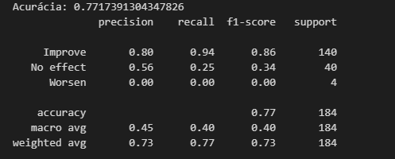

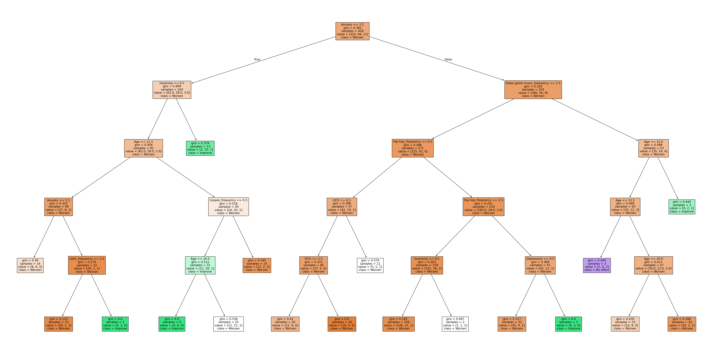
No geral, esse modelo apresentou uma acurácia ok, pois atingiu 77,17%, porém não podemos apenas nos basear nessa métrica para avaliar o modelo como um todo, pois é uma métrica que foi muito influenciada pela classe majoritária "Improve".

Classe "Improve": </br>
- Precision: 0.80 </br>
    - Indica que o modelo conseguiu atingir 80% de precisão das previsões realizadas.    

- Recall: 0.94 </br>
    - Indica que o modelo teve 94% de previsões positivas corretas, indicando uma confiabilidade considerável nessa classe para o modelo.

- F1-Score: 0.86 </br>
    - Indica a média entre Recall e Precisão, onde obteve 86% de média.

- Support: 140 </br>
    - Indica que o modelo teve 140 casos para realizar os testes, o que pode ter influenciado na precisão e recall mais altos.

Classe "No effect":
- Precision: 0.56 </br>
    - Indica que o modelo conseguiu atingir 56% de precisão das previsões realizadas, estando um pouco acima de 50% mas não obtendo um resultado tão satisfatório quando observamos as outras métricas.    

- Recall: 0.25 </br>
    - Indica que o modelo teve 25% de previsões positivas corretas, indicando uma baixa confiabilidade para o modelo referente a essa classe. Isso indica que o modelo pode ter considerado muitos falsos positivos, o que diminui consideravelmente essa métrica.

- F1-Score: 0.34 </br>
    - Indica a média entre Recall e Precisão, onde obteve 34% de média.

- Support: 40 </br>
    - Indica que o modelo teve 40 casos para realizar os testes, o que influenciou nas outras métricas.

Classe "Worsen":
- Precision: 0.0 </br>
    - Indica que o modelo conseguiu atingir 0.0% de precisão das previsões realizadas, não conseguindo atingir nenhuma resultado para a classe em questão.    

- Recall: 0.0 </br>
    - Indica que o modelo teve 0.0% de previsões positivas corretas.

- F1-Score: 0.0 </br>
    - Indica a média entre Recall e Precisão, onde obteve 0.0% de média.

- Support: 4 </br>
    - Indica que o modelo teve 4 casos para realizar os testes, o que tem relacão com as outras métricas terem sido ruins.

#### Árvore de Decisão com Undersampling
Esse modelo foi treinado considerando a aplicação da técnicas de undersampling, para auxiliar no desbalanceamento das classes.

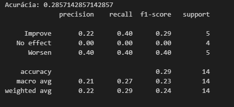

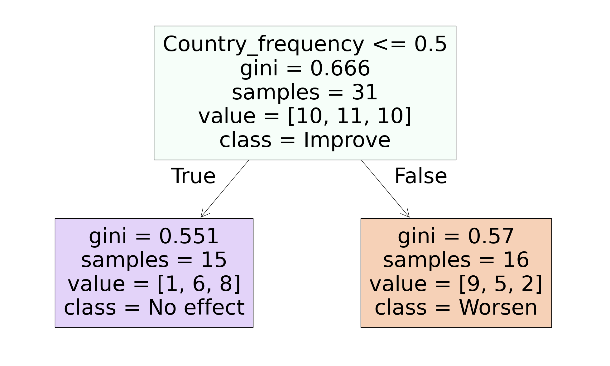

No geral, esse modelo apresentou uma acurácia ruim, pois atingiu 28,57%, o que pode ter relação com a remoção de exemplos, até que a proporção entre as classes esteja equilibrada

Classe "Improve": </br>
- Precision: 0.22 </br>
    - Indica que o modelo conseguiu atingir 22% de precisão das previsões realizadas.    

- Recall: 0.40 </br>
    - Indica que o modelo teve 40% de previsões positivas corretas.

- F1-Score: 0.29 </br>
    - Indica a média entre Recall e Precisão, onde obteve 29% de média.

- Support: 5 </br>
    - Indica que o modelo teve 5 casos para realizar os testes, o que pode ter influenciado na precisão e recall mais altos.

Classe "No effect":
- Precision: 0.0 </br>
    - Indica que o modelo conseguiu atingir 56% de precisão das previsões realizadas.    

- Recall: 0.0 </br>
    - Indica que o modelo teve 0.0% de previsões positivas corretas.

- F1-Score: 0.0 </br>
    - Indica a média entre Recall e Precisão, onde obteve 0.0% de média.

- Support: 4 </br>
    - Indica que o modelo teve 4 casos para realizar os testes, o que influenciou nas outras métricas.

Classe "Worsen":
- Precision: 0.40 </br>
    - Indica que o modelo conseguiu atingir 40.0% de precisão das previsões realizadas.    

- Recall: 0.40 </br>
    - Indica que o modelo teve 40.0% de previsões positivas corretas.

- F1-Score: 0.40 </br>
    - Indica a média entre Recall e Precisão, onde obteve 40.0% de média.

- Support: 5 </br>
    - Indica que o modelo teve 4 casos para realizar os testes, o que tem relacão com as outras métricas terem sido ruins.

#### Árvore de Decisão com Oversampling
Esse modelo foi treinado considerando a aplicação da técnica de Oversampling. que consiste em aumentar os exemplos nas classes minoritárias. Porém, como esse modelo faz esse aumento duplicando os exemplos já existetes ou gerando novas instâncias dos exemplos que já existem, isso pode levar ao overfitting.

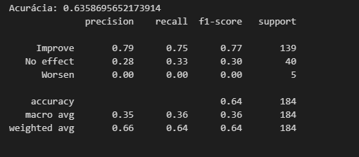

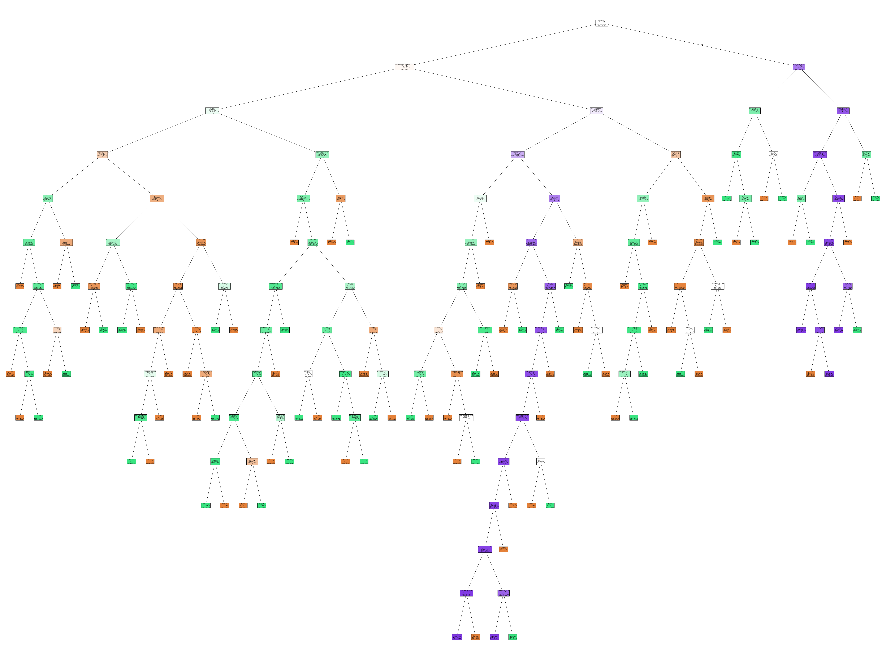

No geral, esse modelo apresentou uma acurácia ok, pois atingiu 63,587%, porém não podemos apenas nos basear nessa métrica para avaliar o modelo como um todo, pois é uma métrica que foi muito influenciada pela classe majoritária "Improve".

Classe "Improve": </br>
- Precision: 0.79 </br>
    - Indica que o modelo conseguiu atingir 79% de precisão das previsões realizadas.    

- Recall: 0.75 </br>
    - Indica que o modelo teve 75% de previsões positivas corretas.

- F1-Score: 0.77 </br>
    - Indica a média entre Recall e Precisão, onde obteve 77% de média.

- Support: 139 </br>
    - Indica que o modelo teve 140 casos para realizar os testes, o que pode ter influenciado na precisão e recall mais altos.

Classe "No effect":
- Precision: 0.28 </br>
    - Indica que o modelo conseguiu atingir 28% de precisão das previsões realizadas.    

- Recall: 0.33 </br>
    - Indica que o modelo teve 33% de previsões positivas corretas.
      
- F1-Score: 0.30 </br>
    - Indica a média entre Recall e Precisão, onde obteve 34% de média.

- Support: 40 </br>
    - Indica que o modelo teve 40 casos para realizar os testes, o que influenciou nas outras métricas.

Classe "Worsen":
- Precision: 0.0 </br>
    - Indica que o modelo conseguiu atingir 0.0% de precisão das previsões realizadas.    

- Recall: 0.0 </br>
    - Indica que o modelo teve 0.0% de previsões positivas corretas.

- F1-Score: 0.0 </br>
    - Indica a média entre Recall e Precisão, onde obteve 0.0% de média.

- Support: 5 </br>
    - Indica que o modelo teve 5 casos para realizar os testes, o que tem relacão com as outras métricas terem sido ruins.

#### Árvore de Decisão com SMOTE
Esse modelo foi treinado considerando a aplicação da técnica de SMOTE, que consiste em criar exemplos sintéticos para as classes minoritárias.

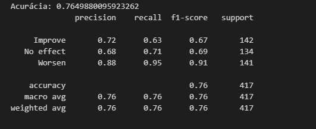

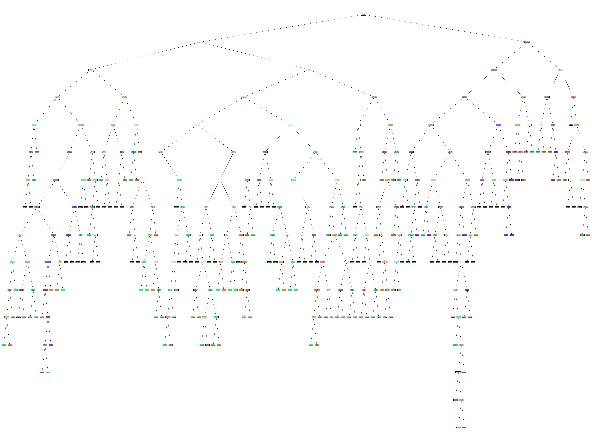

No geral, esse modelo apresentou uma acurácia ok, pois atingiu 76,49%, porém não podemos apenas nos basear nessa métrica para avaliar o modelo como um todo, pois devemos nos basear também nas outras métricas afim de formar uma conclusão sobre o modelo.

Classe "Improve": </br>
- Precision: 0.72 </br>
    - Indica que o modelo conseguiu atingir 72% de precisão das previsões realizadas.    

- Recall: 0.63 </br>
    - Indica que o modelo teve 63% de previsões positivas corretas.

- F1-Score: 0.67 </br>
    - Indica a média entre Recall e Precisão, onde obteve 67% de média.

- Support: 142 </br>
    - Indica que o modelo teve 142 casos para realizar os testes, o que pode ter influenciado na precisão e recall mais altos.

Classe "No effect":
- Precision: 0.68 </br>
    - Indica que o modelo conseguiu atingir 68% de precisão das previsões realizadas.    

- Recall: 0.71 </br>
    - Indica que o modelo teve 71% de previsões positivas corretas.
      
- F1-Score: 0.69 </br>
    - Indica a média entre Recall e Precisão, onde obteve 69.0% de média.

- Support: 134 </br>
    - Indica que o modelo teve 134 casos para realizar os testes, o que influenciou nas outras métricas.

Classe "Worsen":
- Precision: 0.88 </br>
    - Indica que o modelo conseguiu atingir 88.0% de precisão das previsões realizadas.    

- Recall: 0.95 </br>
    - Indica que o modelo teve 95.0% de previsões positivas corretas.

- F1-Score: 0.91 </br>
    - Indica a média entre Recall e Precisão, onde obteve 91.0% de média.

- Support: 141 </br>
    - Indica que o modelo teve 141 casos para realizar os testes, o que tem relacão com as outras métricas terem sido ruins.
 
#### Árvore de Decisão com SMOTE e XGBoost
Esse modelo foi treinado considerando a aplicação da técnica de SMOTE com XGBoost, que consiste em criar exemplos sintéticos para as classes minoritárias e também se beneficia de lidar com dados desbalanceados se utilizando de hiperparâmetros.

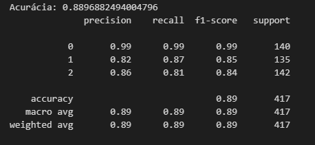

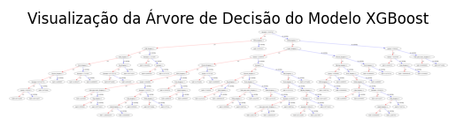

No geral, esse modelo apresentou uma acurácia ok, pois atingiu 88,96%, porém não podemos apenas nos basear nessa métrica para avaliar o modelo como um todo, pois devemos nos basear também nas outras métricas afim de formar uma conclusão sobre o modelo.

Classe "Improve": </br>
- Precision: 0.86 </br>
    - Indica que o modelo conseguiu atingir 86% de precisão das previsões realizadas.    

- Recall: 0.81 </br>
    - Indica que o modelo teve 81% de previsões positivas corretas.

- F1-Score: 0.84 </br>
    - Indica a média entre Recall e Precisão, onde obteve 84% de média.

- Support: 142 </br>
    - Indica que o modelo teve 142 casos para realizar os testes, o que pode ter influenciado na precisão e recall mais altos.

Classe "No effect":
- Precision: 0.88 </br>
    - Indica que o modelo conseguiu atingir 88% de precisão das previsões realizadas.    

- Recall: 0.87 </br>
    - Indica que o modelo teve 87% de previsões positivas corretas.
      
- F1-Score: 0.85 </br>
    - Indica a média entre Recall e Precisão, onde obteve 85.0% de média.

- Support: 135 </br>
    - Indica que o modelo teve 135 casos para realizar os testes..

Classe "Worsen":
- Precision: 0.99 </br>
    - Indica que o modelo conseguiu atingir 99.0% de precisão das previsões realizadas.    

- Recall: 0.99 </br>
    - Indica que o modelo teve 99.0% de previsões positivas corretas.

- F1-Score: 0.99 </br>
    - Indica a média entre Recall e Precisão, onde obteve 99.0% de média.

- Support: 140 </br>
    - Indica que o modelo teve 140 casos para realizar os testes.
 
# Pipeline de pesquisa e análise de dados 
1. Carregamento e exploração do dataset: </br>
    - Utilizamos o pandas para realizar o carregamento do dataset e fizemos algumas análises iniciais dos dados para identificar dados inconsistentes, ausência de dados e dados que precisariam passar por mapeamento ou encode. Nessa análise exploratoria inicial, avaliamos também o balanceamento inicial das classes, considerando a disparidade em casos onde a música teve um efeito de posivo, negativo ou de nenhum efeito.
 
2. Pré-processamento dos dados: </br>
    - Realizamos o mapeamento da variável alvo 'Music effects' para incluir o 'Worsen" e codificamos os valores 'Improve', 'No effect' e 'Worsen' para 1, 0 e -1, respectivamente. </br>
    - > [!NOTE]
    - > Para o teste realizado com XGBoost e SMOTE juntos, tivemos que fazer um enconde diferente para os valores 'Improve', 'No effect' e 'Worsen' para 2, 1 e 01, respectivamente.

3. Treinamento dos modelos: </br>
Utilizamos os seguintes algoritmos supervisionados para a implementação dos modelos:
    3.1 Árvore de Decisão(Decision Tree)
        - Árvore de Decisão com Undersampling
        - Árvore de Decisão com Oversampling
        - Árvore de Decisão com SMOTE
        - Árvore de Decisão com SMOTE e XGBoost

4. Análise dos resultados:
Após o treinamento do modelos, utilizamos as seguintes métricas para avaliar a qualidade e robustez dos modelos
    - Acurácia
    - Precisão
    - F1-score
    - Recall
    - Matrix de Confusão

Utilizamos também a visualização da árvore gerada para melhor interpretação dos dados.

## Resultados Obtidos
### Árvore de Decisão
Este modelo apresentou um desempenho favorável apenas para a classe majoritária "Improve", com as métricas indicando esse desempenho. Porém, para as classes "No Effect" e "Worsen", esse modelo apresentou um desempenho abaixo, não conseguindo ter previsões consideráveis para essas classes.

#### Árvore de Decisão com Undersampling 
Utilizando da técnica de Undersampling, esse modelo apresentou o pior desempenho para todas as classes, tendo que ser desconsiderado da solução final.

#### Árvore de Decisão com Oversampling
Esse modelo utilizou-se da técnica de oversampling e, mesmo se utilizando dessa técnica para lidar com o desbalanceamento das classes, apresentou um desempenho desfavorável no geral. Por mais que na classe de "Improve" tenha conseguido obter métricas relativamente interessantes, no geral obteve uma acurácia menor do que o modelo que utilizou apenas arvore de decisão.

#### Árvore de Decisão com SMOTE
Com a utilização da técnica de SMOTE, esse modelo apresentou uma acurácia de 76% no geral, porém conseguiu lidar relativamente bem com as classes minoritárias. Com essa técnica, conseguimos obter métricas favoráveis para as todas as classes.

#### Árvore de Decisão com SMOTE e XGBoost
Esse modelo alinhou as técnicas de SMOTE e XGBoost e obteve o melhor resultado geral considerando todas as métricas avaliadas. É um bom modelo a ser considerado para a solução final. 

## Conclusão

### Árvore de Decisão
Por se tratar do modelo que não utilizou nenhuma técnica para tratar os desbalanceamentos das classes minoritárias, teve um resultado positivo apenas para a classe "Improve". Sendo assim, utilizamos de outras técnicas para fazer o balanceamento das classes na tentativa de obter melhor resultado para todas as classes e melhor métricas que nos auxilie na tomada de decisão.

#### Árvore de Decisão com Undersampling
Essa técnica reduziu substancialmente os exemplos, o que afetou o desempenho e a capacidade do modelo em realizar o aprendizado. Desse modo, obteve uma acurácia geral muito baixa e as métricas também foram afetadas.

#### Árvore de Decisão com Oversampling
Esse modelo apresentou um enviesamento forte para a classe "Improve". Dessa forma, mesmo após a aplicação da técnica de oversampling, esse modelo apresentou um desempenho ruim para as demais classes, o que indica uma dificuldade do modelo em apresentar resultados que possam ser considerados quando o dataset não consegue ter dados suficientes para todas as classes.

#### Árvore de Decisão com SMOTE
Esse modelo apresentou, com a utilização da técnica de SMOTE para tratar o desbalanceamento das classes, um desempenho favorável para as classes "No effect" e "Worsen". Dessa forma, é um modelo que pode ser utilizado para a solução final, pois conseguiu desempenho para todas as classes.

#### Árvore de Decisão com SMOTE e XGBoost
Agregando as técnicas de SMOTE e XGBoost e aplicando nesse modelo, conseguimos obter o melhor desempenho e as melhores métricas na construção do algoritmo de arvore de decisão. Esse modelo apresentou métricas consistentes e equilibradas para todas as classes, o que auxilia na tomada de decisão a cerca da sua aplicação na solução final.

# CASO 2 - Árvore de Decisão (Random Forest) - Isabela e Renan

## Preparação dos dados


Durante a preparação e análise dos dados, realizamos algumas transformações importantes para garantir maior qualidade e relevância nas informações. Primeiramente, adicionamos uma nova coluna de faixa etária, categorizando os indivíduos em grupos específicos com base em suas idades:

Under 18: para idades menores que 18 anos;
18-24: para idades entre 18 e 24 anos;
25-34: para idades entre 25 e 34 anos;
35-49: para idades entre 35 e 49 anos;
50+: para idades de 50 anos ou mais.
Além disso, realizamos a conversão da frequência de escuta de estilos musicais de valores qualitativos para numéricos, possibilitando análises mais precisas. A correspondência ficou assim:

'Never': 0
'Rarely': 1
'Sometimes': 2
'Very frequently': 3
No que diz respeito ao score de saúde mental, transformamos os valores numéricos em categorias qualitativas para facilitar a interpretação:

'nulo': score igual a 0;
'baixo': score menor ou igual a 3;
'médio': score menor ou igual a 6;
'alto': score maior que 6.

Por fim, realizamos a limpeza do conjunto de dados. Removemos todas as linhas com valores ausentes e eliminamos registros com valores inválidos na coluna de BPM, garantindo a integridade e consistência dos dados para as próximas etapas da análise. Essas transformações foram fundamentais para obter insights mais claros e robustos.

```
import pandas as pd

file_path = "C:\Puc\db_musica_saude.csv"
df = pd.read_csv(file_path)

df.head(), df.columns

df.dropna(inplace=True)

df['Timestamp'] = pd.to_datetime(df['Timestamp'], errors='coerce')

df.dropna(subset=['Timestamp'], inplace=True)

df = df[(df['BPM'] != 0) & (df['BPM'] != 999999999)]

df.head()
```

```
def age_range(age):
    if age < 18:
        return "Under 18"
    elif 18 <= age < 25:
        return "18-24"
    elif 25 <= age < 35:
        return "25-34"
    elif 35 <= age < 50:
        return "35-49"
    else:
        return "50+"

df['age_range'] = df['Age'].apply(age_range)
```
```
def anxiety_level(score):
    if score == 0:
        return 'nulo'
    elif score <= 3:
        return 'baixo'
    elif score <= 6:
        return 'médio'
    else:
        return 'alto'

for col in ['Anxiety', 'Depression', 'Insomnia', 'OCD']:
    df[f'{col}_level'] = df[col].apply(anxiety_level)

# 6. Mapear valores de frequência de gêneros musicais ('Never', 'Rarely', 'Sometimes', 'Very frequently')
freq_mapping = {'Never': 0, 'Rarely': 1, 'Sometimes': 2, 'Very frequently': 3}
frequency_cols = [col for col in df.columns if 'Frequency [' in col]

for col in frequency_cols:
    new_col_name = col.replace("Frequency [", "").replace("]", "") + "_frequency"
    df[new_col_name] = df[col].map(freq_mapping)

df.head()
```
```
df.to_csv("dados_tratados.csv", index=False, encoding="utf-8", sep=",")
```
## Descrição dos modelos utilizados

*Random Forest*

Consiste em um conjunto (ou "floresta") de múltiplas árvores de decisão. Cada árvore é construída usando um subconjunto aleatório dos dados e características.

Combinação de Árvores: As previsões finais são feitas pela média (para regressão) ou votação (para classificação) das previsões de todas as árvores, o que melhora a precisão e a robustez.

Vantagem: Reduz o overfitting que uma única árvore pode ter, tornando-o mais robusto e confiável em dados complexos

*Por que Random Forest foi melhor para este projeto?*

Complexidade dos Dados: O projeto envolve muitos estilos musicais e suas relações com a condição mental, o que pode ser difícil de capturar com precisão por uma única árvore de decisão. O Random Forest, por usar várias árvores, consegue capturar essas complexidades de forma mais eficaz.

Variabilidade e Ruído: Os dados podem conter variabilidade e ruído devido a fatores individuais e subjetivos. O Random Forest suaviza essa variabilidade ao combinar os resultados de múltiplas árvores, fornecendo previsões mais robustas.

Esse modelo é capaz de generalizar melhor novos dados, o que é crucial para prever corretamente os efeitos da música em condições mentais não vistas anteriormente.

## Importação da bibliotecas necessárias e carregamento do dataset

Foram utilizadas as bibliotecas Pandas, Numpy, Matplotlib e Seaborn.

```
# Importando bibliotecas
import pandas as pd
import numpy as np
import matplotlib.pyplot as plt
import seaborn as sns
from sklearn.model_selection import train_test_split
from sklearn.preprocessing import StandardScaler
from sklearn.ensemble import RandomForestClassifier
from sklearn.metrics import classification_report, confusion_matrix
```

# 2. Carregar dados

```
url = '/content/dados_tratados_V2.csv'  # Use barra simples
data = pd.read_csv(url, sep = ';')
```

## Criação de modelos preditivos
### Random Forest desconsiderando o desbalanceamentos das classes

```
# Verificar valores únicos na coluna 'Music effects'
print("Valores únicos antes da limpeza:", data['Music effects'].unique())
Valores únicos antes da limpeza: ['No effect' 'Improve' 'Worsen']
```
```
# Remover registros com valores ausentes na coluna 'Music effects'
data_clean = data.dropna(subset=['Music effects'])
```
```
# Codificar a variável alvo incluindo 'Worsen'
data_clean['Music effects'] = data_clean['Music effects'].map({'Improve': 1, 'No effect': 0, 'Worsen': -1})
```
```
# Verificar os valores únicos após o mapeamento
print("Valores únicos após mapeamento:", data_clean['Music effects'].unique())
Valores únicos após mapeamento: [ 0  1 -1]
```
```
# Separar variáveis independentes e dependentes
X = data_clean[style_columns]
y = data_clean['Music effects']
```
```
# Verificar se ainda há NaNs em y após codificação
print(f'Valores ausentes em y: {y.isnull().sum()}')
Valores ausentes em y: 0
```
```
# Dividir os dados em conjuntos de treino e teste
X_train, X_test, y_train, y_test = train_test_split(X, y, test_size=0.2, random_state=42, stratify=y)
```
```
# Normalizar os dados
scaler = StandardScaler()
X_train = scaler.fit_transform(X_train)
X_test = scaler.transform(X_test)
```
```
# Modelagem
model = RandomForestClassifier(random_state=42)
model.fit(X_train, y_train)
```


```
# Avaliação do modelo
y_pred = model.predict(X_test)
print(confusion_matrix(y_test, y_pred))
print(classification_report(y_test, y_pred))
```
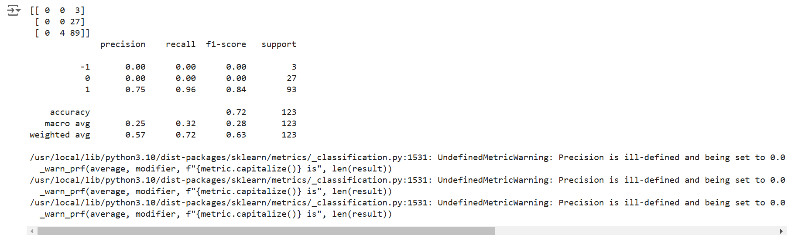

#### Conclusões
Conclusões sobre a análise
A análise dos resultados do modelo Random Forest com as métricas de classificação (precision, recall, f1-score, e support):

Classe -1 ("Worsen"):
Precision, Recall, F1-Score: Todos são 0.00, indicando que o modelo não conseguiu prever corretamente nenhum exemplo desta classe. Isso pode ser devido ao baixo número de exemplos no conjunto de teste, o que dificulta o aprendizado do modelo para esta classe. Support: Apenas 3 exemplos, o que é bastante limitado para treinar e testar o modelo de forma eficaz.

Classe 0 ("No effect"):
Precision, Recall, F1-Score: Todos são 0.00, sugerindo que o modelo não conseguiu prever corretamente nenhum exemplo desta classe. Este é um problema significativo, especialmente porque há um número maior de exemplos (27) em comparação com a classe -1. Support: 27 exemplos, ainda assim, o modelo não conseguiu capturar as características desta classe.

Classe 1 ("Improve"):
Precision: 0.75, indicando que 75% das previsões feitas para esta classe estavam corretas. Recall: 0.96, o que é bastante alto, significando que o modelo identificou corretamente 96% dos exemplos desta classe. F1-Score: 0.84, uma boa indicação de equilíbrio entre precisão e recall para esta classe. Support: 93 exemplos, um número substancial que provavelmente ajudou o modelo a aprender melhor as características desta classe. Acurácia Geral: 0.72 (72%), que reflete a proporção de previsões corretas, mas é amplamente influenciada pela classe majoritária (1).

Macro Avg e Weighted Avg:
Macro Avg: As médias de precisão, recall e F1-Score são bastante baixas (0.25, 0.32, 0.28), refletindo o desempenho ruim em classes minoritárias. Weighted Avg: Considera o suporte de cada classe, resultando em valores melhores (0.57, 0.72, 0.63), mas ainda assim indicando a necessidade de melhorias para as classes -1 e 0.

Conclusões e Recomendações:
O modelo está fortemente enviesado para a classe majoritária (1), o que é uma indicação de desbalanceamento de classes. É interessante considerar técnicas de balanceamento de dados, como oversampling, undersampling, ou uso de algoritmos que lidem melhor com dados desbalanceados.

### Random Forest com Undersampling

Undersampling é uma técnica de balanceamento de classes que reduz o número de exemplos na classe majoritária. Isso é feito removendo aleatoriamente exemplos até que a proporção entre as classes esteja equilibrada. Embora simples, pode levar à perda de informações valiosas se muitos exemplos forem removidos.

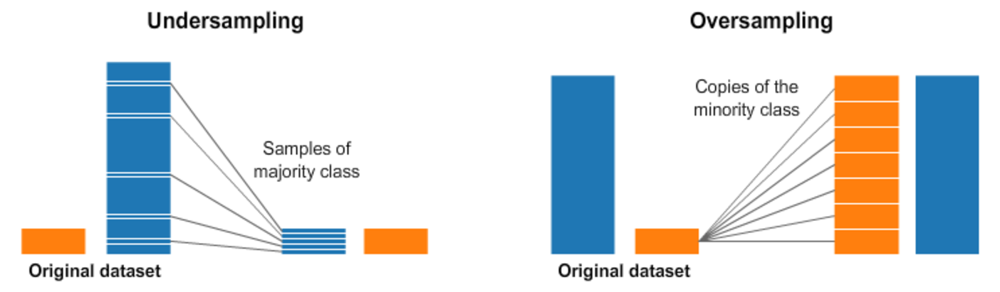
[Fonte da Imagem](https://www.kaggle.com/code/rafjaa/resampling-strategies-for-imbalanced-datasets#t1)

```
# Importando bibliotecas
import pandas as pd
import numpy as np
import matplotlib.pyplot as plt
import seaborn as sns
from sklearn.model_selection import train_test_split
from sklearn.preprocessing import StandardScaler
from sklearn.ensemble import RandomForestClassifier
from sklearn.metrics import classification_report, confusion_matrix
from imblearn.under_sampling import RandomUnderSampler
```
```
# 2. Carregar dados
url = '/content/dados_tratados_V2.csv'  # Use barra simples
data = pd.read_csv(url, sep = ';')
```
```
# Verificar valores únicos na coluna 'Music effects'
print("Valores únicos antes da limpeza:", data['Music effects'].unique())
Valores únicos antes da limpeza: ['No effect' 'Improve' 'Worsen']
```
```
# Remover registros com valores ausentes na coluna 'Music effects'
data_clean = data.dropna(subset=['Music effects'])
```
```
# Codificar a variável alvo incluindo 'Worsen'
data_clean['Music effects'] = data_clean['Music effects'].map({'Improve': 1, 'No effect': 0, 'Worsen': -1})
```
```
# Verificar os valores únicos após o mapeamento
print("Valores únicos após mapeamento:", data_clean['Music effects'].unique())
Valores únicos após mapeamento: [ 0  1 -1]
```
```
# Separar variáveis independentes e dependentes
X = data_clean[style_columns]
y = data_clean['Music effects']
```
```
# Verificar se ainda há NaNs em y após codificação
print(f'Valores ausentes em y: {y.isnull().sum()}')
Valores ausentes em y: 0
```
```
# Dividir os dados em conjuntos de treino e teste
X_train, X_test, y_train, y_test = train_test_split(X, y, test_size=0.2, random_state=42, stratify=y)
```
```
# Visualização do balanço das classes antes do undersampling
plt.figure(figsize=(8, 4))
sns.countplot(x=y_train)
plt.title('Distribuição das Classes Antes do Undersampling')
plt.show()
```
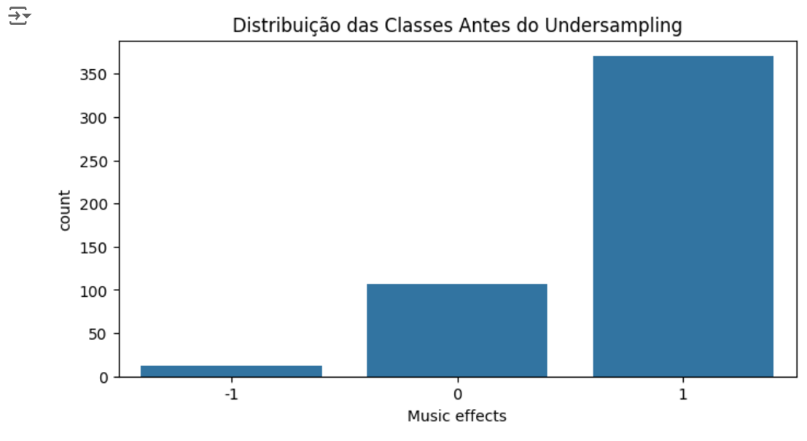
```
# Aplicar undersampling no conjunto de treino
undersample = RandomUnderSampler(random_state=42)
X_train_resampled, y_train_resampled = undersample.fit_resample(X_train, y_train)
```
```
# Visualização do balanço das classes após o undersampling
plt.figure(figsize=(8, 4))
sns.countplot(x=y_train_resampled)
plt.title('Distribuição das Classes Após o Undersampling')
plt.show()
```
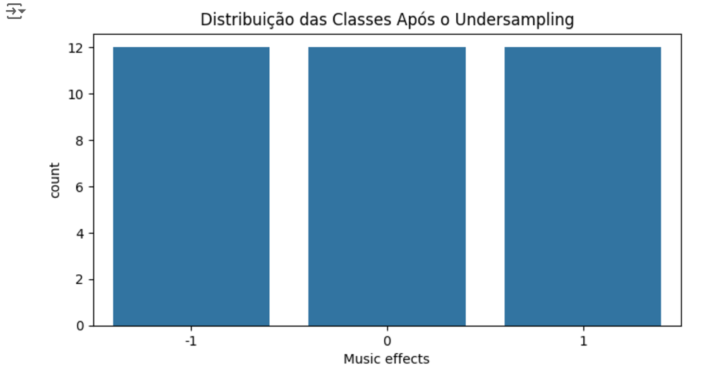
```
# Normalizar os dados
scaler = StandardScaler()
X_train_resampled = scaler.fit_transform(X_train_resampled)
X_test = scaler.transform(X_test)
```
```
# Modelagem
model = RandomForestClassifier(random_state=42)
model.fit(X_train_resampled, y_train_resampled)
```

```
# Avaliação do modelo
y_pred = model.predict(X_test)
print(confusion_matrix(y_test, y_pred))
print(classification_report(y_test, y_pred))
```
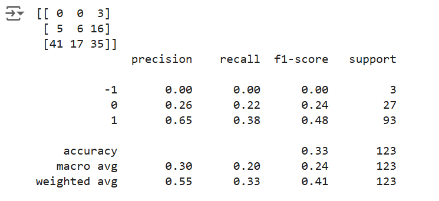


#### Conclusões
A análise dos resultados do modelo após a aplicação de undersampling com as métricas de classificação (precision, recall, f1-score, e support):

Classe -1 ("Worsen"):
Precision, Recall, F1-Score: Todos são 0.00, indicando que o modelo não conseguiu prever corretamente nenhum exemplo desta classe. Isso sugere que a classe -1 continua a ser muito difícil de prever, possivelmente devido ao número muito pequeno de exemplos no conjunto de teste. Support: Apenas 3 exemplos, o que não é suficiente para o modelo aprender características significativas, mesmo com undersampling.

Classe 0 ("No effect"):
Precision: 0.26, indicando que apenas 26% das previsões feitas para esta classe estavam corretas. Recall: 0.22, baixo, significando que o modelo identificou corretamente apenas 22% dos exemplos desta classe. F1-Score: 0.24, indicando um equilíbrio insatisfatório entre precisão e recall para esta classe. Support: 27 exemplos, ainda um número pequeno, mas que deveria ser suficiente para alguma melhora.

Classe 1 ("Improve"):
Precision: 0.65, indicando que 65% das previsões feitas para esta classe estavam corretas. Recall: 0.38, o que é consideravelmente mais baixo do que o esperado, significando que o modelo identificou corretamente apenas 38% dos exemplos desta classe. F1-Score: 0.48, o que é uma queda significativa em comparação com os métodos anteriores. Support: 93 exemplos, que é a classe majoritária, mas ainda assim, o desempenho é menor que o esperado. Acurácia Geral: 0.33 (33%), o que é bastante baixo, sugerindo que o modelo tem dificuldade em fazer previsões corretas após o undersampling.

Macro Avg e Weighted Avg:
Macro Avg: As médias de precisão, recall e F1-Score são baixas (0.30, 0.20, 0.24), refletindo o desempenho ruim em todas as classes. Weighted Avg: Considera o suporte de cada classe, resultando em valores ainda insatisfatórios (0.55, 0.33, 0.41).

O undersampling aparentemente reduziu a capacidade do modelo de generalizar bem, especialmente para a classe majoritária 1. A estratégia de undersampling pode ter removido muitos exemplos úteis da classe majoritária, prejudicando o aprendizado do modelo.

### Random Forest com Oversampling
Oversampling é uma técnica que aumenta o número de exemplos nas classes minoritárias duplicando-os aleatoriamente ou gerando novas instâncias a partir dos existentes. Isso ajuda a equilibrar a proporção de classes, mas pode levar ao overfitting se não for feito cuidadosamente.

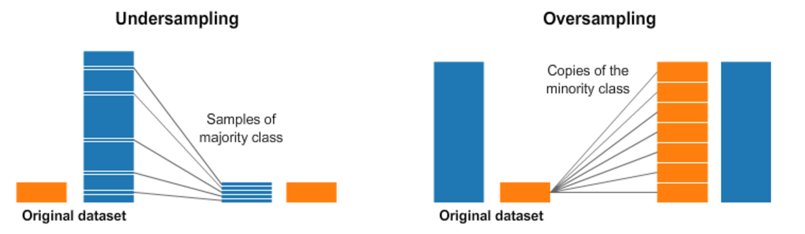
[Fonte da Imagem](https://www.kaggle.com/code/rafjaa/resampling-strategies-for-imbalanced-datasets#t1)


```
# Importando bibliotecas
import pandas as pd
import numpy as np
import matplotlib.pyplot as plt
import seaborn as sns
from sklearn.model_selection import train_test_split
from sklearn.preprocessing import StandardScaler
from sklearn.ensemble import RandomForestClassifier
from sklearn.metrics import classification_report, confusion_matrix
from imblearn.over_sampling import RandomOverSampler
```
```
# 2. Carregar dados
url = '/content/dados_tratados_V2.csv'  # Use barra simples
data = pd.read_csv(url, sep = ';')
```
```
# Verificar valores únicos na coluna 'Music effects'
print("Valores únicos antes da limpeza:", data['Music effects'].unique())
Valores únicos antes da limpeza: ['No effect' 'Improve' 'Worsen']
```
```
# Remover registros com valores ausentes na coluna 'Music effects'
data_clean = data.dropna(subset=['Music effects'])
```
```
# Codificar a variável alvo incluindo 'Worsen'
data_clean['Music effects'] = data_clean['Music effects'].map({'Improve': 1, 'No effect': 0, 'Worsen': -1})
```
```
# Verificar os valores únicos após o mapeamento
print("Valores únicos após mapeamento:", data_clean['Music effects'].unique())
Valores únicos após mapeamento: [ 0  1 -1]
```
```
# Separar variáveis independentes e dependentes
X = data_clean[style_columns]
y = data_clean['Music effects']
```
```
# Verificar se ainda há NaNs em y após codificação
print(f'Valores ausentes em y: {y.isnull().sum()}')
Valores ausentes em y: 0
```
```
# Dividir os dados em conjuntos de treino e teste
X_train, X_test, y_train, y_test = train_test_split(X, y, test_size=0.2, random_state=42, stratify=y)
```
```
# Visualização do balanço das classes antes do oversampling
plt.figure(figsize=(8, 4))
sns.countplot(x=y_train)
plt.title('Distribuição das Classes Antes do Oversampling')
plt.show()
```

```
# Aplicar oversampling no conjunto de treino
ros = RandomOverSampler(random_state=42)
X_train_resampled, y_train_resampled = ros.fit_resample(X_train, y_train)
```
```
# Visualização do balanço das classes após o oversampling
plt.figure(figsize=(8, 4))
sns.countplot(x=y_train_resampled)
plt.title('Distribuição das Classes Após o Oversampling')
plt.show()
```
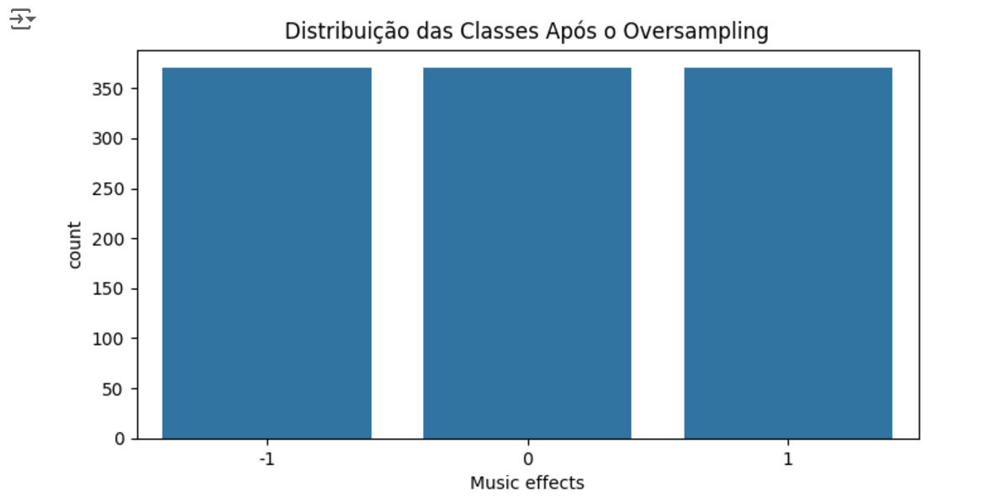
```
# Normalizar os dados
scaler = StandardScaler()
X_train_resampled = scaler.fit_transform(X_train_resampled)
X_test = scaler.transform(X_test)
```
```
# Modelagem
model = RandomForestClassifier(random_state=42)
model.fit(X_train_resampled, y_train_resampled)
```

```
# Avaliação do modelo
y_pred = model.predict(X_test)
print(confusion_matrix(y_test, y_pred))
print(classification_report(y_test, y_pred))
```
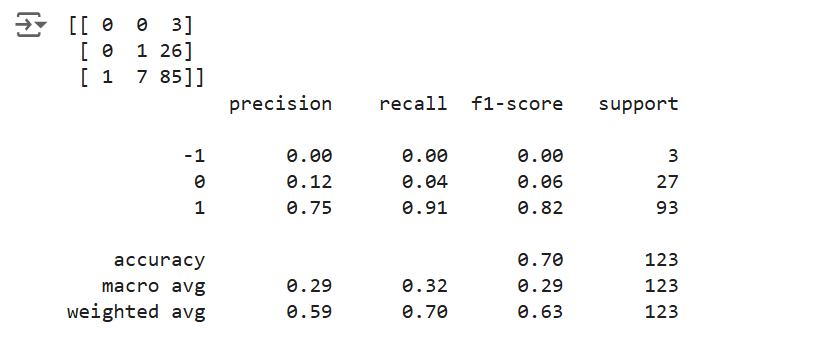


#### Conclusões

A análise dos resultados do modelo após o oversampling com as métricas de classificação (precision, recall, f1-score, e support) é a seguinte:

Classe -1 ("Worsen"):
Precision, Recall, F1-Score: Todos são 0.00, indicando que o modelo não conseguiu prever corretamente nenhum exemplo desta classe. Isso é um problema, especialmente considerando que fizemos oversampling para tentar melhorar o desempenho nesta classe. Support: Apenas 3 exemplos no conjunto de teste, o que é insuficiente para o modelo aprender características representativas desta classe, mesmo após o oversampling.

Classe 0 ("No effect"):
Precision: 0.12, indicando que apenas 12% das previsões feitas para esta classe estavam corretas. Recall: 0.04, muito baixo, significando que o modelo identificou corretamente apenas 4% dos exemplos desta classe. F1-Score: 0.06, muito baixo, indicando um equilíbrio insatisfatório entre precisão e recall para esta classe. Support: 27 exemplos, um número que, ainda que melhor do que a classe -1, não parece suficiente para um bom desempenho.

Classe 1 ("Improve"):
Precision: 0.75, indicando que 75% das previsões feitas para esta classe estavam corretas. Recall: 0.91, muito alto, significando que o modelo identificou corretamente 91% dos exemplos desta classe. F1-Score: 0.82, uma boa indicação de equilíbrio entre precisão e recall para esta classe. Support: 93 exemplos, que continua a ser a classe majoritária. Acurácia Geral: 0.70 (70%), que reflete a proporção de previsões corretas, mas ainda fortemente influenciada pela classe majoritária (1).

Macro Avg e Weighted Avg:
Macro Avg: As médias de precisão, recall e F1-Score são baixas (0.29, 0.32, 0.29), refletindo o desempenho ruim nas classes minoritárias. Weighted Avg: Considera o suporte de cada classe, resultando em valores melhores (0.59, 0.70, 0.63), mas ainda indicando a necessidade de melhorias para as classes -1 e 0.

O modelo ainda está fortemente enviesado para a classe majoritária (1), apesar do oversampling. Mesmo após o oversampling, as classes -1 e 0 não têm um desempenho satisfatório, sugerindo que o modelo pode não estar capturando características distintivas suficientes para essas classes. Tal cenário torna-se recomendável a exploração de outras técnicas de balanceamento.

### XGBoost


XGBoost é um poderoso algoritmo de boosting que pode lidar com dados desbalanceados através do ajuste de hiperparâmetros como scale_pos_weight, que ajusta a importância das classes minoritárias. Ele constrói modelos sequencialmente, corrigindo erros de modelos anteriores, e é conhecido por sua eficiência e precisão em problemas complexos.

```
# Importando bibliotecas
import pandas as pd
import numpy as np
import matplotlib.pyplot as plt
import seaborn as sns
from sklearn.model_selection import train_test_split
from sklearn.preprocessing import StandardScaler
from sklearn.metrics import classification_report, confusion_matrix
import xgboost as xgb
```
```
# 2. Carregar dados
url = '/content/dados_tratados_V2.csv'  # Use barra simples
data = pd.read_csv(url, sep = ';')
```
```
# Verificar valores únicos na coluna 'Music effects'
print("Valores únicos antes da limpeza:", data['Music effects'].unique())
Valores únicos antes da limpeza: ['No effect' 'Improve' 'Worsen']
```
```
# Remover registros com valores ausentes na coluna 'Music effects'
data_clean = data.dropna(subset=['Music effects'])
```
```
# Codificar a variável alvo com valores positivos
data_clean['Music effects'] = data_clean['Music effects'].map({'Improve': 2, 'No effect': 1, 'Worsen': 0})
```
```
# Verificar os valores únicos após o mapeamento
print("Valores únicos após mapeamento:", data_clean['Music effects'].unique())
Valores únicos após mapeamento: [1 2 0]
```
```
# Separar variáveis independentes e dependentes
style_columns = [col for col in data.columns if 'frequency' in col]
X = data_clean[style_columns]
y = data_clean['Music effects']
```
```
# Verificar se ainda há NaNs em y após codificação
print(f'Valores ausentes em y: {y.isnull().sum()}')
Valores ausentes em y: 0
```
```
# Dividir os dados em conjuntos de treino e teste
X_train, X_test, y_train, y_test = train_test_split(X, y, test_size=0.2, random_state=42, stratify=y)
```
```
# Normalizar os dados
scaler = StandardScaler()
X_train = scaler.fit_transform(X_train)
X_test = scaler.transform(X_test)
```
```
# Ajustar hiperparâmetros do XGBoost
model = xgb.XGBClassifier(
    use_label_encoder=False,
    eval_metric='mlogloss',
    scale_pos_weight=2,
    max_depth=5,
    n_estimators=200,
    learning_rate=0.1,
    gamma=0.1,
    subsample=0.8,
    colsample_bytree=0.8,
    random_state=42
)
```
```
# Treinar o modelo
model.fit(X_train, y_train)
```
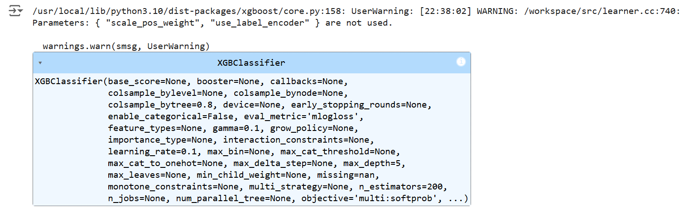
```
# Avaliação do modelo
y_pred = model.predict(X_test)
print(confusion_matrix(y_test, y_pred))
print(classification_report(y_test, y_pred))
```
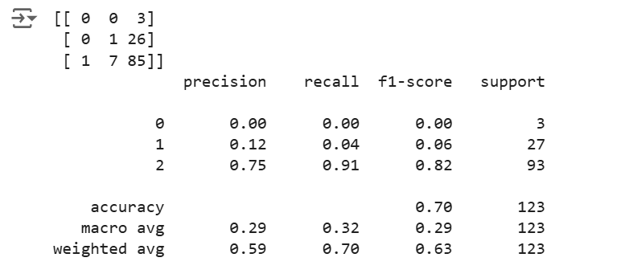

#### Conclusões
A análise dos resultados do modelo XGBoost após o ajuste dos hiperparâmetros mostra o seguinte:

Classe 0 ("Worsen"):
Precision, Recall, F1-Score: Todos são 0.00, indicando que o modelo ainda não consegue prever corretamente nenhum exemplo desta classe. Isso pode ser devido ao número extremamente pequeno de exemplos (apenas 3) no conjunto de teste, o que torna difícil para o modelo aprender características significativas para esta classe.

Classe 1 ("No effect"):
Precision: 0.12, indicando que apenas 12% das previsões feitas para esta classe estavam corretas. Recall: 0.04, muito baixo, significando que o modelo identificou corretamente apenas 4% dos exemplos desta classe. F1-Score: 0.06, indicando um equilíbrio insatisfatório entre precisão e recall para esta classe. Support: 27 exemplos, um número que deveria permitir algum nível de aprendizado, mas o modelo ainda não conseguiu capturar as características desta classe.

Classe 2 ("Improve"):
Precision: 0.75, indicando que 75% das previsões feitas para esta classe estavam corretas. Recall: 0.91, bastante alto, significando que o modelo identificou corretamente 91% dos exemplos desta classe. F1-Score: 0.82, uma boa indicação de equilíbrio entre precisão e recall para esta classe. Support: 93 exemplos, que continua a ser a classe majoritária e bem representada. Acurácia Geral: 0.70 (70%), que reflete a proporção de previsões corretas, mas ainda fortemente influenciada pela classe majoritária (2).

Macro Avg e Weighted Avg:
Macro Avg: As médias de precisão, recall e F1-Score são baixas (0.29, 0.32, 0.29), refletindo o desempenho ruim nas classes minoritárias. Weighted Avg: Considera o suporte de cada classe, resultando em valores melhores (0.59, 0.70, 0.63), mas ainda indicando a necessidade de melhorias para as classes 0 e 1.

Apesar de ter apresentado um resultado superior às tentativas anteriores, o uso do XGBoost não foi suficiente para melhorar substancialmente o desempenho nas classes minoritárias.

### Random Forest com SMOTE (Synthetic Minority Over-sampling Technique)

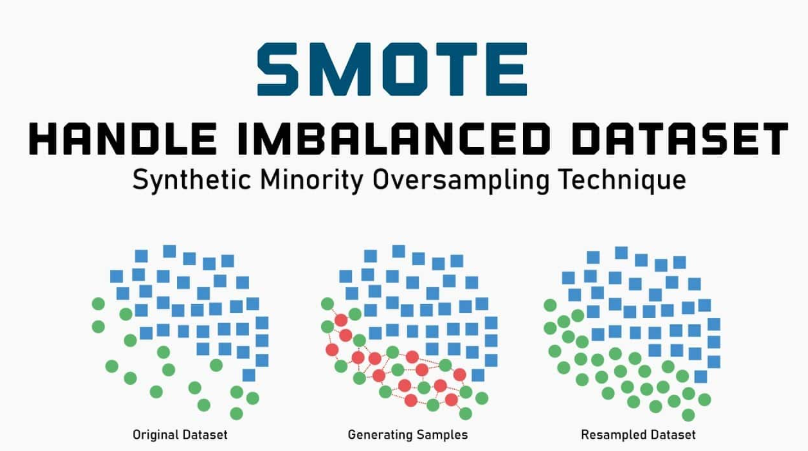

SMOTE é uma técnica avançada de oversampling que cria exemplos sintéticos para a classe minoritária. Em vez de simplesmente duplicar exemplos, SMOTE gera novos dados interpolando entre exemplos existentes, aumentando a diversidade dos dados minoritários e ajudando a evitar overfitting.


```
# Importando bibliotecas
import pandas as pd
import numpy as np
import matplotlib.pyplot as plt
import seaborn as sns
from sklearn.model_selection import train_test_split
from sklearn.preprocessing import StandardScaler
from sklearn.ensemble import RandomForestClassifier
from sklearn.metrics import classification_report, confusion_matrix
from imblearn.over_sampling import SMOTE
```
```
# Separar variáveis independentes e dependentes
style_columns = [col for col in data.columns if 'frequency' in col]
X = data_clean[style_columns]
y = data_clean['Music effects']
```
```
# Verificar valores únicos na coluna 'Music effects'
print("Valores únicos antes da limpeza:", data['Music effects'].unique())
Valores únicos antes da limpeza: ['No effect' 'Improve' 'Worsen']
```
```
# Remover registros com valores ausentes na coluna 'Music effects'
data_clean = data.dropna(subset=['Music effects'])
```
```
# Codificar a variável alvo incluindo 'Worsen'
data_clean['Music effects'] = data_clean['Music effects'].map({'Improve': 1, 'No effect': 0, 'Worsen': -1})
```
```
# Verificar os valores únicos após o mapeamento
print("Valores únicos após mapeamento:", data_clean['Music effects'].unique())
Valores únicos após mapeamento: [ 0  1 -1]
```
```
# Separar variáveis independentes e dependentes
X = data_clean[style_columns]
y = data_clean['Music effects']
```
```
# Verificar se ainda há NaNs em y após codificação
print(f'Valores ausentes em y: {y.isnull().sum()}')
Valores ausentes em y: 0
```
```
# Dividir os dados em conjuntos de treino e teste
X_train, X_test, y_train, y_test = train_test_split(X, y, test_size=0.2, random_state=42, stratify=y)
```
```
# Visualização do balanço das classes antes do SMOTE
plt.figure(figsize=(8, 4))
sns.countplot(x=y_train)
plt.title('Distribuição das Classes Antes do SMOTE')
plt.show()
```
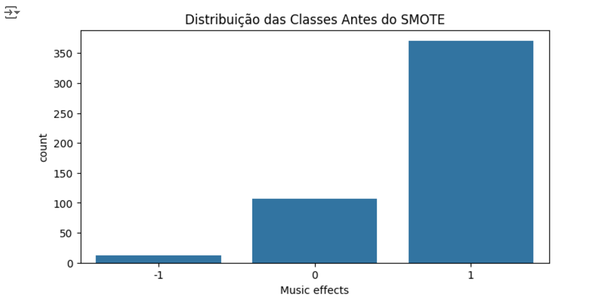
```
# Aplicar SMOTE no conjunto de treino
smote = SMOTE(random_state=42)
X_train_resampled, y_train_resampled = smote.fit_resample(X_train, y_train)
```
```
# Visualização do balanço das classes após o SMOTE
plt.figure(figsize=(8, 4))
sns.countplot(x=y_train_resampled)
plt.title('Distribuição das Classes Após o SMOTE')
plt.show()
```
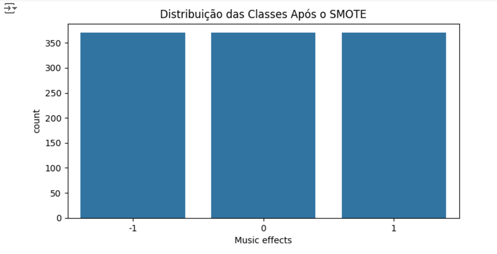
```
# Normalizar os dados
scaler = StandardScaler()
X_train_resampled = scaler.fit_transform(X_train_resampled)
X_test = scaler.transform(X_test)
```
```
# Modelagem
model = RandomForestClassifier(random_state=42)
model.fit(X_train_resampled, y_train_resampled)
```
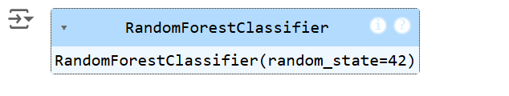
```
# Avaliação do modelo
y_pred = model.predict(X_test)
print(confusion_matrix(y_test, y_pred))
print(classification_report(y_test, y_pred))
```
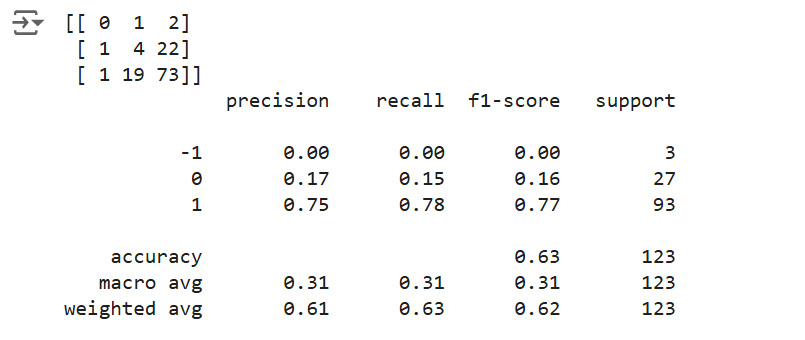

#### Conclusões

A análise dos resultados do modelo usando SMOTE para lidar com o desbalanceamento das classes revela o seguinte:

Classe -1 ("Worsen"):
Precision, Recall, F1-Score: Todos são 0.00, indicando que o modelo não conseguiu prever corretamente nenhum exemplo desta classe. Isso ainda é um problema, possivelmente devido ao número muito pequeno de exemplos no conjunto de teste.

Classe 0 ("No effect"):
Precision: 0.17, indicando que 17% das previsões feitas para esta classe estavam corretas. Recall: 0.15, um pouco melhor, significando que o modelo identificou corretamente 15% dos exemplos desta classe. F1-Score: 0.16, indicando um equilíbrio ligeiramente melhor entre precisão e recall, mas ainda insatisfatório. Support: 27 exemplos, um número que deveria permitir algum nível de aprendizado.

Classe 1 ("Improve"):
Precision: 0.75, indicando que 75% das previsões feitas para esta classe estavam corretas. Recall: 0.78, o que é bom, significando que o modelo identificou corretamente 78% dos exemplos desta classe. F1-Score: 0.77, uma boa indicação de equilíbrio entre precisão e recall para esta classe. Support: 93 exemplos, que continua a ser a classe majoritária e bem representada. Acurácia Geral: 0.63 (63%), que reflete a proporção de previsões corretas, mas ainda fortemente influenciada pela classe majoritária (1).

Macro Avg e Weighted Avg:
Macro Avg: As médias de precisão, recall e F1-Score são baixas (0.31, 0.31, 0.31), refletindo o desempenho ruim nas classes minoritárias. Weighted Avg: Considera o suporte de cada classe, resultando em valores melhores (0.61, 0.63, 0.62), mas ainda indicando a necessidade de melhorias para as classes -1 e 0.

O uso de SMOTE ajudou a melhorar ligeiramente o desempenho na classe 0, mas não foi suficiente para a classe -1.

### Conclusão sobre os modelos utilizados

Com base nas análises dos resultados apresentados nas diferentes tentativas, a abordagem que apresentou os melhores resultados em termos de equilíbrio entre precisão, recall e f1-score foi o uso do XGBoost. Aqui está o resumo dos resultados mais relevantes dessa abordagem:

Classe 2 ("Improve") teve um desempenho consistente com boa precisão e recall, mantendo um bom f1-score.

Acurácia Geral foi de 70% que é uma medida da proporção de previsões corretas.

Weighted Avg apresentou valores mais equilibrados, indicando que o modelo conseguiu manter um desempenho razoável ao considerar a distribuição das classes.

Razões para o Desempenho:

O XGBoost é robusto e inclui regularização, que ajuda a prevenir overfitting. O ajuste dos hiperparâmetros permitiu otimizar o aprendizado do modelo, especialmente para a classe majoritária, embora as classes minoritárias ainda representem um desafio significativo devido à falta de dados.

## Análise dos efeitos da música por faixa etária

Essa visualização ajuda a destacar como diferentes faixas etárias respondem à música em termos de melhoria das condições mentais.

```
# Mapear 'Music effects' para valores numéricos
data['Music effects'] = data['Music effects'].map({'Improve': 1, 'No effect': 0, 'Worsen': -1})
```
```
# Calcular a média dos efeitos da música por faixa etária
age_effects = data.groupby('age_range')['Music effects'].mean()
```
```
# Configurar o estilo do Seaborn
sns.set(style="whitegrid")
```
```
# Criar uma visualização da melhoria dos efeitos da música por faixa etária
plt.figure(figsize=(10, 6))
sns.barplot(x=age_effects.index, y=age_effects.values, palette="viridis")
plt.title('Média dos Efeitos da Música por Faixa Etária')
plt.ylabel('Média dos Efeitos da Música')
plt.xlabel('Faixa Etária')
plt.xticks(rotation=45)
plt.ylim(0, 1)
plt.tight_layout()
plt.show()
```
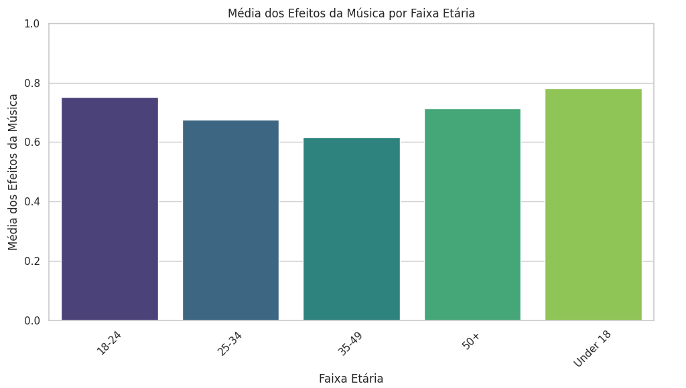

### Conclusões sobre a análise

O gráfico acima mostra a média dos efeitos da música por faixa etária. Observamos que:

As faixas etárias "Under 18" e "18-24" apresentam as maiores médias de melhoria nos efeitos da música, indicando que essas faixas etárias experimentam os maiores benefícios emocionais ou mentais ao ouvir música.

Faixas etárias mais avançadas, como "50+", também mostram uma melhoria considerável, mas não tão alta quanto as mais jovens.

As faixas "25-34" e "35-49" têm médias mais baixas, mas ainda positivas, sugerindo que a música tem um impacto benéfico, embora menos pronunciado, nessas idades.

## Correlação entre os estilos musicais com a melhoria na condição mental

O gráfico acima mostra a correlação entre a frequência dos estilos musicais e a melhoria na condição mental dos ouvintes.

```
# Selecionar colunas relacionadas a frequência dos estilos musicais
style_columns = [col for col in data.columns if 'frequency' in col]
```
```
# Calcular a correlação entre a melhoria da condição mental e a frequência dos estilos musicais
correlations = data[style_columns + ['Music effects']].corr()['Music effects'].drop('Music effects').sort_values(ascending=False)
```
```
# Visualizar as correlações
plt.figure(figsize=(12, 6))
sns.barplot(x=correlations.index, y=correlations.values, palette="viridis")
plt.title('Correlação entre Estilos Musicais e Melhoria na Condição Mental')
plt.ylabel('Correlação')
plt.xlabel('Estilo Musical (Frequência)')
plt.xticks(rotation=45)
plt.tight_layout()
plt.show()
```

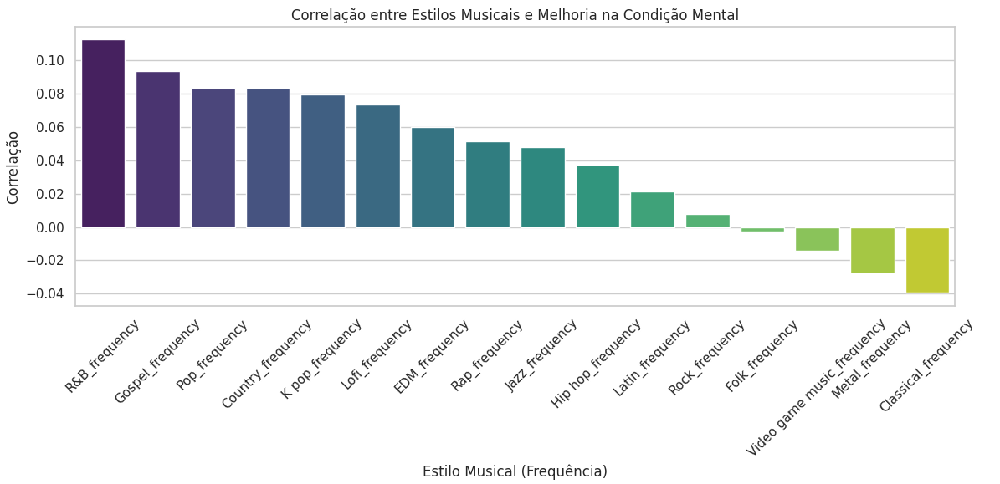

### Conclusões sobre a análise

R&B apresenta a maior correlação positiva com a melhoria, indicando que ouvir R&B está associado a uma melhora na condição mental.

Gospel também tem uma forte correlação positiva, sugerindo que é benéfico para a condição mental.

Pop e Country ambos têm correlações positivas significativas, indicando que são eficazes na melhoria da condição mental.

Clássica e Metal têm correlações levemente negativas, sugerindo que podem não estar associados a uma melhoria na condição mental, pelo menos no contexto desta análise.

## Conclusão do Caso 2

### Conclusões técnicas

O objetivo inicial deste projeto era determinar se a frequência com que uma pessoa escuta diferentes estilos musicais está relacionada com a melhoria das suas condições mentais, conforme indicado pela coluna Music effects na base de dados.

Durante o processo, várias abordagens foram exploradas para lidar com o desafio de classes desbalanceadas, incluindo técnicas de oversampling, undersampling, e o uso de algoritmos de ensemble, como o XGBoost.

Resultados Principais:
Classe Majoritária ("Improve") consistentemente apresentou bons resultados de precisão e recall, indicando que o modelo consegue identificar bem os casos em que a música melhora as condições mentais.

Classes Minoritárias ("Worsen" e "No effect") permaneceram desafiadoras devido ao número insuficiente de exemplos, o que resultou em desempenho fraco nessas categorias.

Ajuste de Hiperparâmetros com XGBoost: Apresentou o melhor equilíbrio no desempenho geral, com uma acurácia de 70%, mas ainda enfrenta limitações nas classes minoritárias.

Desafios e Limitações:
O desbalanceamento de classes foi o principal obstáculo, com dados insuficientes para algumas categorias, limitando a capacidade do modelo de aprender e generalizar. As técnicas de SMOTE e XGBoost ajudaram parcialmente, mas não resolveram completamente o problema de previsão para as classes menos representadas.

Recomendações Futuras:
Coleta de Mais Dados: Especialmente para as classes "Worsen" e "No effect", para fornecer um conjunto de dados mais equilibrado.

Exploração de Novas Características: Investigar outras características que possam influenciar a resposta emocional à música.

Combinação de Métodos: Considerar o uso de métodos de ensemble adicionais ou híbridos que possam capturar melhor as diferenças entre as classes.

Análise Qualitativa: Realizar uma análise qualitativa para entender melhor os fatores subjacentes que possam não ser capturados quantitativamente.

Em conclusão, embora o modelo tenha mostrado capacidade de prever a melhoria das condições mentais através da música para a classe majoritária, mais esforços são necessários para alcançar um desempenho robusto nas classes minoritárias. A continuidade deste projeto pode beneficiar-se de uma coleta de dados mais ampla e de técnicas analíticas mais sofisticadas.

### Considerações finais

A análise dos dados revela que a música, de fato, exerce uma influência positiva na condição mental das pessoas, com variações notáveis entre diferentes faixas etárias e estilos musicais.
Influência por Faixa Etária:
Menores de 18 anos e jovens adultos (18-24 anos) são as faixas etárias que apresentam a maior melhoria na condição mental ao ouvir música. Isso sugere que a música desempenha um papel particularmente significativo na promoção do bem-estar mental entre os jovens, possivelmente devido à sua fase de desenvolvimento emocional e social intensa.

*Adultos acima de 50 anos também mostram uma resposta positiva considerável, *indicando que a música continua a ser uma fonte importante de apoio emocional e mental, mesmo em idades mais avançadas.

Estilos Musicais com Maior Efeito:
R&B e Gospel emergem como os estilos musicais com a maior correlação positiva com a melhoria da condição mental. Esses gêneros são conhecidos por suas letras emotivas e ritmos envolventes, que podem criar uma conexão emocional mais profunda com os ouvintes. Pop e Country também demonstram uma influência positiva significativa, sugerindo que seus temas acessíveis e melodias cativantes contribuem para o bem-estar dos ouvintes.

Observações Gerais:
Embora a música clássica e o metal apresentem correlações ligeiramente negativas, isso pode refletir preferências pessoais ou contextos de audição específicos que não se alinham com a melhoria do bem-estar mental em geral.

Dessa forma, a música pode ser considerada uma ferramenta poderosa para a melhoria da condição mental, especialmente entre jovens e adultos mais velhos, com certos estilos exercendo uma influência mais significativa. Essas descobertas podem guiar futuras iniciativas de bem-estar que utilizem a música como meio de promover a saúde mental em diversas populações.

# Vídeo Explicativo - Caso 02 

Para acesso do vídeo acesse:

https://drive.google.com/drive/folders/1BbgB_29gA9RQ_wQTPIhvEOTXmBlGsepE?usp=sharing

# Avaliação dos modelos criados

## Métricas utilizadas no Caso 01 e 02

Na avaliação dos modelos de classificação, utilizamos algumas métricas para avaliar a qualidade e desempenho do modelo. Cada métrica utilizada tem o objetivo de fornecer uma perspectiva diferente sobre como o modelo está se comportando em relação ao conjunto de dados.

1. Acurácia </br>
Mede a proporção de previsões corretas (tanto positivas quanto negativas) em relação ao total de amostras. Essa é uma métrica muito útil quando as classes estão balanceadas e não é recomendada para problemas com classes desbalanceadas, pois pode acontecer de ocultar o desempenho para classes minoritárias.

    - Por que usamos? </br>
A acurácia fornece uma visão geral sobre o desempenho do modelo ao medir a proporção de previsões corretas. Apesar de ser uma métrica genérica, ela é útil como ponto de partida para identificar se o modelo está aprendendo algo relevante dos dados.

    - Justificativa no projeto: </br>
Ajuda a determinar se o modelo, de forma geral, consegue distinguir entre os diferentes impactos da música ("Improve", "Worsen" ou "No effect") na saúde mental.
Entretanto, dado o possível desbalanceamento das classes (como menor incidência de "Worsen"), não é suficiente como única métrica para avaliar os modelos. 

2. Precision (Precisão) </br>
Mede a proporção de previsões positivas corretas em relação ao total de previsões positivas realizadas. Essa é uma métrica muito importante de ser avaliada em problemas onde o custo de um falso positivo é alto. Um exemplo desses cenários é em Diagnósticos médicos e fraudes financeiras.

    - Por que usamos? </br>
A precisão mede a proporção de previsões positivas corretas feitas pelo modelo, evitando falsos positivos. É essencial quando queremos ter confiança nas classificações positivas.

    - Justificativa no projeto: </br>
Crucial para identificar quais gêneros musicais são previstos como tendo efeitos positivos ("Improve") ou neutros ("No Effect") com alta confiabilidade.
Reduz a chance de atribuir erroneamente um gênero musical a um efeito positivo, o que seria enganoso na análise final.

3. Recall (Revocação ou Sensibilidade) </br>
Mede a proporção de previsões positivas corretas em relação ao total de amostras que são realmente positivas. Essa é uma métrica muito importante de ser avaliada em problemas onde o custo de um falso positivo é alto. Um exemplo desses cenários é em detectar doenças graves e fraudes financeiras.

    - Por que usamos? </br>
Recall mede a capacidade do modelo de encontrar todas as instâncias positivas reais. Ela é importante quando o objetivo é minimizar os falsos negativos.

    - Justificativa no projeto: </br>
Importante para garantir que identificamos todos os casos em que um gênero musical melhora ou piora o estado mental, mesmo que isso implique aceitar alguns falsos positivos.
Em contextos relacionados à saúde mental, deixar de identificar um efeito real pode ser crítico. Por exemplo, se um gênero musical contribui para piorar a saúde mental, queremos ter certeza de identificá-lo.

4. F1-Score </br>
Essa é uma métrica que combina precision e recall em uma única métrica e que considera o equilíbrio entre as duas. É a média harmônica dessas métricas. É uma métrica útil quando há desbalanceamento de classes e que permite avaliar o desempenho geral de forma mais equilibrada do que a acurácia.

    - Por que usamos? </br>
Combina precisão e recall em uma única métrica, equilibrando os trade-offs entre os dois. É particularmente útil para problemas de classificação multiclasses e com desbalanceamento.

    - Justificativa no projeto: </br>
Como as classes podem estar desbalanceadas (por exemplo, menos dados de "Worsen"), o F1-Score garante que não priorizamos excessivamente uma métrica em detrimento da outra.
Ajuda a avaliar, de forma equilibrada, a capacidade do modelo de identificar os efeitos positivos, neutros e negativos da música.

5. Confusion Matrix (Matriz de Confusão) (Usado apenas no caso 01) </br>
Apresenta os resultados reais versus previstos em uma tabela que detalha os verdadeiros positivos, verdadeiros negativos, falsos positivos e falsos negativos. Essa métrica permite uma visualização detalhada dos erros do modelo e é essencial para identificar problemas de desbalanceamento ou classes específicas onde o modelo tem dificuldade.

    - Por que usamos? </br>
A matriz de confusão detalha os erros do modelo para cada classe, mostrando como as previsões se alinham com os valores reais.

    - Justificativa no projeto: </br>
Fundamental para identificar quais efeitos ("Improve", "No Effect", "Worsen") estão sendo mais ou menos identificados corretamente.
Permite compreender onde o modelo está errando (por exemplo, confundir "Worsen" com "No Effect"), possibilitando ajustes específicos para melhorar o desempenho.


# CASO 3 - Random Forest - Eduardo Ramón

# Preparação dos dados
Para a prepação dos dados que serão utilizados no modelo, foi utilizado os seguintes passos:

## Limpeza dos dados
Foi realizado a remoção das linhas com dados faltantes


df2=df.copy()
df2 = df2.dropna()

## Codificacao dos dados
Foi realizado o mapeamento da variável alvo 'Music effects' convertendo-a em uma target binária onde os resultados 'Worsen" e  "No effect" se tornam apenas um resultado, sendo esse "No improve".


df_relevantes['target_binary'] = df_relevantes['Music effects'].apply(lambda x: 'Improve' if x == 'Improve' else 'No Improve')


## Variáveis consideradas para treinamento do modelo
Para realizar o treinamento e teste do modelo, foi realizado a separação das colunas relevantes contendo as colunas de frequência, dos gêneros, das doenças mentais, da idade e dos efeitos da musica no tratamento.


colunas_relevantes = ['Age','Fav genre','Anxiety','Frequency','Depression', 'Insomnia', 'OCD','Music effects']
colunas_existentes = [col for col in colunas_relevantes if col in df2.columns]

df_relevantes = df2[colunas_existentes]


## Separação dos dados 
Para o treinamento e teste do modelo, separei os dados em 80% do dataset para treinamento e 20% para testes do modelo.


X_train, X_test, y_train, y_test = train_test_split(X, y, test_size=0.2, random_state= 50)


# Descrição dos modelos
## Radom Forest 
A Floresta Aleatória foi escolhida para este projeto porque ela é um modelo extremamente poderoso e eficiente, especialmente em situações complexas como a que estamos tratando — entender os efeitos da música na saúde mental. Ela combina a força de várias árvores de decisão, o que a torna ainda mais precisa e robusta. Separo abaixo alguns dos motivos pelo qual o modelo foi escolhido. 

1. Alta Precisão e Robustez: A Floresta Aleatória combina várias árvores de decisão, o que a torna mais confiável e menos propensa a erros ou sobreajuste nos dados.
   
2. Lida com Dados Diversificados: Ela pode trabalhar com dados tanto contínuos quanto categóricos, sem necessidade de transformações complexas, sendo ideal para problemas com variáveis mistas.

3. Captura de Padrões Complexos: A Floresta Aleatória consegue identificar relações não-lineares e interações entre variáveis, o que é fundamental para entender como diferentes fatores influenciam a saúde mental com base na música.

4. Flexibilidade e Versatilidade: Ela pode ser aplicada facilmente em problemas de classificação, mesmo com dados variados e sem precisar de grandes ajustes.

Para a construção do modelo, foi realizado a vericição do melhor algoritimo a ser utilizado importando as seguintes bibliotecas e o dataset foi carregado em memória pelo pandas.


import pandas as pd 
import seaborn as sns
import matplotlib.pyplot as plt
import numpy as np
from sklearn.model_selection import train_test_split
from sklearn.preprocessing import StandardScaler
from sklearn.metrics import accuracy_score, precision_score, recall_score, f1_score
from sklearn.metrics import roc_curve, auc, classification_report, precision_recall_curve
from sklearn.ensemble import RandomForestClassifier
from sklearn.model_selection import GridSearchCV

No trecho de código a seguir, foi realizado o carregamento de algumas informações do dataset


df = pd.read_csv("mxmh_survey_results.csv")
df.head()


O trecho a seguir é responsável por calcular cada valor único que aparece na coluna 'Music effects' com os resultados de 'Improve', 'No effect' e 'Worsen'


counts = df_relevantes['Music effects'].value_counts()
percentages = df_relevantes['Music effects'].value_counts(normalize=True) * 100

Para fazer a junção dos valores 'worsen' e 'no effect', foi utilizado o código a seguir para criar uma nova coluna chamada 'target_binary', onde todos os valores diferentes de 'improve' foram agrupados como 'No Improve', simplificando a análise. Isso permitiu trabalhar com duas categorias claras: 'Improve' e 'No Improve'.


df_relevantes['target_binary'] = df_relevantes['Music effects'].apply(lambda x: 'Improve' if x == 'Improve' else 'No Improve')

Foi criado um gráfico para a visualização dos resultados através do código abaixo.


plt.figure(figsize=(10, 6))
bars = sns.barplot(x=counts.index, y=counts.values, palette='viridis')


for i, (count, percentage) in enumerate(zip(counts.values, percentages)):
    bars.text(i, count, f'n={count}\n{percentage:.1f}%',
             ha='center', va='bottom')


plt.title('Distribuição da Variável Music effects')
plt.xlabel('Classes')
plt.ylabel('Contagem')


plt.show()


O trecho a seguir é responsável por calcular cada valor único que aparece na coluna 'Music effects' com os resultados de 'Improve'e 'No Improve'.


counts = df_relevantes['target_binary'].value_counts()
percentages = df_relevantes['target_binary'].value_counts(normalize=True) * 100

O trecho a seguir é responsável por calcular cada valor único que aparece na coluna 'Music effects' com os resultados de 'Improve'e 'No Improve'.


counts = df_relevantes['target_binary'].value_counts()
percentages = df_relevantes['target_binary'].value_counts(normalize=True) * 100

Foi criado um gráfico para a visualização dos resultados através do código abaixo.


plt.figure(figsize=(10, 6))
bars = sns.barplot(x=counts.index, y=counts.values, palette='viridis')

for i, (count, percentage) in enumerate(zip(counts.values, percentages)):
    bars.text(i, count, f'n={count}\n{percentage:.1f}%', 
             ha='center', va='bottom')


plt.title('Distribuição da Target Binária')
plt.xlabel('Classes')
plt.ylabel('Contagem')


plt.show()


 O código a seguir foi utilizado para criar uma nova coluna chamada 'target'. Ele verifica se o valor na coluna 'target_binary' é igual a 'Improve'. Se for, o valor será True, que é convertido para 1. Se não for, o valor será False, que é convertido para 0. Assim, a coluna 'target' terá valores binários (0 ou 1) representando se o efeito da música foi considerado como "melhora" ou não.
 

 df_relevantes['target'] = (df_relevantes['target_binary'] == 'Improve').astype(int)

  Foi criado um código pd.get_dummies() que foi usado para criar variáveis dummies a partir da coluna 'Fav genre' (gênero favorito). Cada valor único da coluna se tornou uma nova coluna binária, onde 1 indica que o gênero é o preferido e 0 indica que não é. Essas novas colunas são adicionadas ao DataFrame df_relevantes.


df_relevantes = pd.concat([df_relevantes, pd.get_dummies(df_relevantes['Fav genre'], prefix='genre')], axis=1)


Aqui é feito a separação dos dados X e y, onde X são as informações que o modelo vai usar para aprender e y é o que queremos prever 'Improve' ou 'No Improve' (se a música teve ou não efeito positivo)


X = df_relevantes.drop('target', axis=1)
y = df_relevantes['target']


Neste trecho é feito a separação dos dados para teste e treinamento

X_train, X_test, y_train, y_test = train_test_split(X, y, test_size=0.2, random_state= 50)


Fiz a otimização de hiperparâmetros para o modelo de Random Forest e  foi definindo o grid de parâmetros para teste.


param_grid = {
    'n_estimators': [100, 200, 300],
    'max_depth': [4, 5],      
    'min_samples_split': [ 5, 10],      
    'min_samples_leaf': [ 5, 10],          
    'max_features': ['sqrt', 'log2']   
}


Em seguida foi criado o modelo base


rf_base = RandomForestClassifier(random_state=50)


Para testar várias combinações de hiperparâmetros do modelo e encontrar a melhor configuração com base em uma métrica de avaliação foi utilizado o código a seguir


grid_search = GridSearchCV(
    estimator=rf_base,
    param_grid=param_grid,
    cv=5,                  
    n_jobs=-1,            
    scoring='accuracy',      
    verbose=1             


Os trechos de códigos a seguir mostram o treinamento dos modelos com todos os parâmetros, a visualização dos melhores parametros encontrado, a seleção do melhor modelo encontrado, previsões com o melhor modelo (probabilidades), a aplicação o limiar de 0,7 para transformar as probabilidades em classes, e a avaliação do modelo otimizado.

*1. O treinamento dos modelos com todos os parâmetros*

print("Iniciando busca em grid...")
grid_search.fit(X_train, y_train)


*2.  A visualização dos melhores parametros encontrado*

print("\nMelhores parâmetros encontrados:")
print(grid_search.best_params_)


*3.  A seleção do melhor modelo encontrado*

melhor_modelo = grid_search.best_estimator_


*4. A aplicação o limiar de 0,7 para transformar as probabilidades em classes*

y_prob = melhor_modelo.predict_proba(X_test)[:, 1] 
y_prob_train = melhor_modelo.predict_proba(X_train)[:, 1]  


limiar = 0.7
y_pred = (y_prob >= limiar).astype(int)
y_pred_train = (y_prob_train >= limiar).astype(int)


print("\nDesempenho do modelo otimizado:")
print(f"Acurácia: {accuracy_score(y_train, y_pred_train):.4f}")
print("\nRelatório de classificação:")
print(classification_report(y_train, y_pred_train))


*5. A avaliação do modelo otimizado*


print("\nDesempenho do modelo otimizado:")
print(f"Acurácia: {accuracy_score(y_test, y_pred):.4f}")
print("\nRelatório de classificação:")
print(classification_report(y_test, y_pred))


Após a análise das métricas de qualidade, é feito a visualização  dos resultados para cada combinação de parâmetros testada.


resultados = pd.DataFrame(grid_search.cv_results_)
resultados_ordenados = resultados.sort_values('rank_test_score')
print("\nTop 5 melhores combinações de parâmetros:")
print(resultados_ordenados[['params', 'mean_test_score', 'std_test_score']].head())


## Curva ROC

Utilizei a curva ROC para ver como o modelo se comportava ao tentar classificar corretamente as amostras em diferentes limiares. Levando em consideração que a área sob a curva (AUC) é uma medida que mostra o quão bem o modelo consegue separar as duas classes: quanto mais alta a AUC, melhor o modelo é em identificar corretamente os casos positivos e negativos, sendo que uma AUC próxima de 1 indica um desempenho muito bom. 

Para a construção do ROC, foram importadas as bibliotecas necessárias e criadas as seguintes codificações:


from sklearn.metrics import roc_curve, auc, classification_report, precision_recall_curve


import matplotlib.pyplot as plt
from sklearn.metrics import roc_curve, auc


*Fazendo previsões com o melhor modelo (probabilidades)* 


y_prob = melhor_modelo.predict_proba(X_test)[:, 1]  # Probabilidade da classe positiva


*Calculando FPR (Taxa de Falsos Positivos) e TPR (Taxa de Verdadeiros Positivos)* 


fpr, tpr, thresholds = roc_curve(y_test, y_prob)


*Calculando a área sob a curva (AUC)*


roc_auc = auc(fpr, tpr)

 Após as previsões e calculos foi criado um trecho de código para que o gráfico ROC fosse exibido, tendo como resultado a AUC aparecendo como 0.72, bem próxima de 1 indicando um bom desempenho como mostra o código e a figura abaixo:
 

plt.figure(figsize=(8, 6))
plt.plot(fpr, tpr, color='blue', lw=2, label=f'Curva ROC (AUC = {roc_auc:.4f})')
plt.plot([0, 1], [0, 1], color='gray', lw=2, linestyle='--')  # Linha de base (aleatória)
plt.xlabel('Taxa de Falsos Positivos (FPR)')
plt.ylabel('Taxa de Verdadeiros Positivos (TPR)')
plt.title('Curva ROC')
plt.legend(loc='lower right')
plt.grid(True)
plt.show()


## Curvas de Precisão e Recall

Neste caso, a curva de precisão e recall foi utilizada para ajustar o limiar do modelo, ajudando a encontrar um equilíbrio entre identificar corretamente os casos em que a música melhora a saúde mental e evitar identificar falsos positivos. Isso permite que o modelo seja mais preciso, focando na identificação de verdadeiros melhoramentos sem errar tanto ao classificar casos negativos. Para isso criei os códigos abaixo:

*1. Importar as bibliotecas necessárias para plotar gráficos e calcular a curva de precisão e recall.*

import matplotlib.pyplot as plt
from sklearn.metrics import precision_recall_curve


*2. Fazendo previsões com o melhor modelo (probabilidades)*

y_prob = melhor_modelo.predict_proba(X_test)[:, 1]  # Probabilidade da classe positiva


*3.Calculando precisão, recall e os limiares*


precision, recall, thresholds = precision_recall_curve(y_test, y_prob)


Com o código criado a seguir, foi possível gerar a visualização do gráfico de Curvas de Precisão e Recall, conforme mostrado abaixo, juntamente com a imagem resultante.


plt.figure(figsize=(8, 6))
plt.plot(thresholds, precision[:-1], color='blue', lw=2, label='Precisão')
plt.plot(thresholds, recall[:-1], color='red', lw=2, label='Recall')
plt.xlabel('Limiar de Decisão')
plt.ylabel('Valor')
plt.title('Curvas de Precisão e Recall')
plt.legend(loc='best')
plt.grid(True)
plt.show()


*(O corte foi feito na junção da Precisão e Recall)*


# Avaliação dos modelos criados

## Métricas utilizadas
Para avaliar a performance dos modelos de classificação, utilizamos diversas métricas, cada uma oferecendo uma visão diferente sobre o comportamento do modelo em relação aos dados. Essas métricas ajudam a entender melhor os pontos fortes e fracos de cada modelo.

*1. Acurácia </br>*
A acurácia mede a proporção de previsões corretas (tanto positivas quanto negativas) em relação ao total de amostras. Essa métrica é útil quando as classes estão equilibradas, mas pode ser enganosa em casos de classes desbalanceadas, onde pode ocultar o desempenho em classes minoritárias.

*Por que usamos?</br>*
A acurácia dá uma visão geral do desempenho do modelo, mostrando se ele consegue fazer previsões corretas de forma consistente. Embora seja uma métrica básica, é útil para começar a entender como o modelo está se saindo.

 *Justificativa no projeto:</br>*
Ela ajuda a verificar se o modelo é capaz de distinguir os diferentes impactos da música na saúde mental (como "Improve" ou "No Improve"). 

*2. Precision (Precisão) </br>* 
A precisão indica a proporção de previsões positivas corretas em relação ao total de previsões positivas feitas. Ela é especialmente importante quando o custo de um falso positivo é alto, como em diagnósticos médicos ou fraudes financeiras.

 *Por que usamos?</br>*
A precisão ajuda a evitar que o modelo classifique erroneamente exemplos negativos como positivos. Isso é fundamental quando precisamos garantir que nossas previsões positivas sejam realmente precisas.

 *Justificativa no projeto:</br>*
É essencial para garantir que o modelo acerte ao classificar quais gêneros musicais realmente melhoram ou não o estado mental sem gerar falsas conclusões.

*3. Recall (Revocação ou Sensibilidade)</br>*
O recall mede a capacidade do modelo de identificar todas as amostras positivas, em relação ao total de amostras realmente positivas. Ele é fundamental quando queremos minimizar os falsos negativos.

*Por que usamos?</br>*
O recall avalia o quão bem o modelo consegue encontrar todos os exemplos positivos reais. Isso é importante quando a principal preocupação é não deixar passar nenhum caso relevante.

*Justificativa no projeto:</br>*
Para garantir que o modelo identifique todos os casos em que um gênero musical tem um impacto real na saúde mental, mesmo que isso signifique aceitar alguns falsos positivos. Em questões de saúde mental, perder um efeito relevante pode ser prejudicial.

*4. F1-Score</br>*
O F1-Score combina as métricas de precisão e recall, levando em consideração o equilíbrio entre elas. Ele é útil especialmente quando há desbalanceamento de classes, já que proporciona uma avaliação mais equilibrada do desempenho do modelo.

*Por que usamos?</br>*
O F1-Score oferece uma média harmônica entre precisão e recall, ajudando a equilibrar os trade-offs entre as duas métricas. É especialmente útil para cenários com muitas classes desbalanceadas.

*Justificativa no projeto:</br>*
Como as classes podem estar desbalanceadas, o F1-Score permite avaliar o modelo de forma equilibrada, sem favorecer excessivamente a precisão ou o recall. Ele ajuda a medir como o modelo lida com os efeitos positivos, neutros e negativos da música.

 
# Pipeline de pesquisa e análise de dados
1. Carregamento e exploração do dataset:
2. Pré-processamento dos dados:
3. Treinamento dos modelos:
4. Análise dos resultados:


 
## Conclusão

O propósito deste projeto foi explorar se a frequência com que uma pessoa escuta diversos gêneros musicais está ligada a melhorias em sua saúde mental, conforme refletido na coluna "Music effects" do conjunto de dados. 

Ao longo do processo, várias abordagens foram exploradas para lidar com o problema das classes desbalanceadas, incluindo a transformação das classes "No effect" e "Worsen" em uma única classe "No Improve", a fim de simplificar a distribuição e melhorar o desempenho do modelo.

Resultados Principais:
A classe majoritária ("Improve") apresentou consistentemente bons resultados de precisão e recall, o que sugere que o modelo é eficaz em identificar corretamente os casos em que a música tem um impacto positivo nas condições mentais.

Classes Minoritárias ("No Improve") essa classe continuara sendo difícel de modelar devido à escassez de exemplos, o que resultou em um desempenho insatisfatório nessas categorias.

Desafios e Limitações:
O desbalanceamento entre as classes foi o principal desafio, pois a escassez de dados em algumas categorias impediu que o modelo aprenda de forma eficaz e faça boas generalizações.

Coleta de Dados Adicionais: Focar na ampliação do conjunto de dados, especialmente para as classes "Worsen" e "No effect", visando equilibrar melhor as categorias.

Investigação de Novas Variáveis: Explorar novas características que possam ter impacto na resposta emocional à música.

Dado o modelo construido podemos verificar um resultado aceitável na prenveção de melhorias na saúde mental na classe "Improve", mesmo tendo poucos dados no dataset para tratamento, ainda assim acredito que o projeto poderia ser melhorado, caso fosse composto por mais dados para serem tratados.

# Vídeo Explicativo - Caso 03

https://drive.google.com/file/d/1iuBeEfITjXS6UFwFBxgj2pwor1luTVoq/view?usp=drivesdk

<!-- # Preparação dos dados

Nesta etapa, deverão ser descritas todas as técnicas utilizadas para pré-processamento/tratamento dos dados.

Algumas das etapas podem estar relacionadas à:

* Limpeza de Dados: trate valores ausentes: decida como lidar com dados faltantes, seja removendo linhas, preenchendo com médias, medianas ou usando métodos mais avançados; remova _outliers_: identifique e trate valores que se desviam significativamente da maioria dos dados.

* Transformação de Dados: normalize/padronize: torne os dados comparáveis, normalizando ou padronizando os valores para uma escala específica; codifique variáveis categóricas: converta variáveis categóricas em uma forma numérica, usando técnicas como _one-hot encoding_.

* _Feature Engineering_: crie novos atributos que possam ser mais informativos para o modelo; selecione características relevantes e descarte as menos importantes.

* Tratamento de dados desbalanceados: se as classes de interesse forem desbalanceadas, considere técnicas como _oversampling_, _undersampling_ ou o uso de algoritmos que lidam naturalmente com desbalanceamento.

* Separação de dados: divida os dados em conjuntos de treinamento, validação e teste para avaliar o desempenho do modelo de maneira adequada.
  
* Manuseio de Dados Temporais: se lidar com dados temporais, considere a ordenação adequada e técnicas específicas para esse tipo de dado.
  
* Redução de Dimensionalidade: aplique técnicas como PCA (Análise de Componentes Principais) se a dimensionalidade dos dados for muito alta.

* Validação Cruzada: utilize validação cruzada para avaliar o desempenho do modelo de forma mais robusta.

* Monitoramento Contínuo: atualize e adapte o pré-processamento conforme necessário ao longo do tempo, especialmente se os dados ou as condições do problema mudarem.

* Entre outras....

Avalie quais etapas são importantes para o contexto dos dados que você está trabalhando, pois a qualidade dos dados e a eficácia do pré-processamento desempenham um papel fundamental no sucesso de modelo(s) de aprendizado de máquina. É importante entender o contexto do problema e ajustar as etapas de preparação de dados de acordo com as necessidades específicas de cada projeto.

# Descrição dos modelos

Nesta seção, conhecendo os dados e de posse dos dados preparados, é hora de descrever os algoritmos de aprendizado de máquina selecionados para a construção dos modelos propostos. Inclua informações abrangentes sobre cada algoritmo implementado, aborde conceitos fundamentais, princípios de funcionamento, vantagens/limitações e justifique a escolha de cada um dos algoritmos. 

Explore aspectos específicos, como o ajuste dos parâmetros livres de cada algoritmo. Lembre-se de experimentar parâmetros diferentes e principalmente, de justificar as escolhas realizadas.

Como parte da comprovação de construção dos modelos, um vídeo de demonstração com todas as etapas de pré-processamento e de execução dos modelos deverá ser entregue. Este vídeo poderá ser do tipo _screencast_ e é imprescindível a narração contemplando a demonstração de todas as etapas realizadas.

# Avaliação dos modelos criados

## Métricas utilizadas

Nesta seção, as métricas utilizadas para avaliar os modelos desenvolvidos deverão ser apresentadas (p. ex.: acurácia, precisão, recall, F1-Score, MSE etc.). A escolha de cada métrica deverá ser justificada, pois esta escolha é essencial para avaliar de forma mais assertiva a qualidade do modelo construído. 

## Discussão dos resultados obtidos

Nesta seção, discuta os resultados obtidos pelos modelos construídos, no contexto prático em que os dados se inserem, promovendo uma compreensão abrangente e aprofundada da qualidade de cada um deles. Lembre-se de relacionar os resultados obtidos ao problema identificado, a questão de pesquisa levantada e estabelecendo relação com os objetivos previamente propostos. 

# Pipeline de pesquisa e análise de dados

Em pesquisa e experimentação em sistemas de informação, um pipeline de pesquisa e análise de dados refere-se a um conjunto organizado de processos e etapas que um profissional segue para realizar a coleta, preparação, análise e interpretação de dados durante a fase de pesquisa e desenvolvimento de modelos. Esse pipeline é essencial para extrair _insights_ significativos, entender a natureza dos dados e, construir modelos de aprendizado de máquina eficazes. 

## Observações importantes

Todas as tarefas realizadas nesta etapa deverão ser registradas em formato de texto junto com suas explicações de forma a apresentar  os códigos desenvolvidos e também, o código deverá ser incluído, na íntegra, na pasta "src".

Além disso, deverá ser entregue um vídeo onde deverão ser descritas todas as etapas realizadas. O vídeo, que não tem limite de tempo, deverá ser apresentado por **todos os integrantes da equipe**, de forma que, cada integrante tenha oportunidade de apresentar o que desenvolveu e as  percepções obtidas. -->
