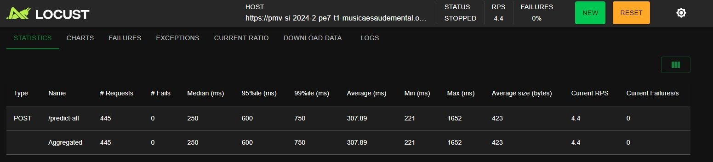

# Implantação da solução

## Hospedagem

A API utilizada foi hospedada na plataforma Render, utilizando o código diretamente do GitHub. Render é uma plataforma que possibilita a hospedagem gratuita de aplicações e oferece ferramentas para que essas aplicações sejam executadas sem problemas. O Render atende a proposta da aplicação, porque não vai ser uma aplicação com um grande tráfego de usuários, logo os impactos de performance de se utilizar uma hospedagem gratuita ao invés de um serviço de hospedagem na nuvem, não será sentido, e ainda possui a vantagem de rodar diretamente do repositório.

## Capacidade Operacional

Pela natureza da aplicação, não é esperado um grande tráfego de pessoas ao nível de congestionamento, as pessoas irão acessar inicialmente pela curiosidade de saber dos efeitos que as músicas têm nelas, porém logo essa carga será estabilizada, fazendo com que tenham poucos níveis de stress no servidor. Com a carga estabilizada, é esperado poucas falhas por parte do servidor e que todas as requisições consigam ser processadas em menos de 1 segundo. Em uma possível situação em que o servidor esteja lidando com a mesma quantidade de entrada e saída de usuários, alguns erros podem acontecer e a espera pela resposta da requisição pode ser de 10 a 20 segundos. Em caso de uma sobrecarga, o servidor começará a devolver uma quantidade de erros consideráveis, sob um tempo instável, podendo a chegar a 1 minuto dependendo da sobrecarga.

Segue algumas prints de testes de stress realizado utilizando o Locust.

Teste realizado com 10 usuários simultâneos fazendo requisição, com a taxa de transferência de uma pessoa por segundo. Esse teste foi feito para simular um cenário tranquilo, onde não haverá muitas requisições simultâneas, e o resultado foi um bom tempo com baixo tempo para realizar a requisição

Teste realizado com 200 usuários simultâneos fazendo requisição e com uma taxa de transferência de 10 pessoas por segundo. Esse teste simula um cenário mais pesado, e nele começamos a ver as falhas acontecerem no servidor, onde ele não consegue lidar com tantas requisições simultâneas.

## Teste

### Avaliar impactos da música (CT01)

**Sumário**: O usuário deve ser capaz de preencher os formulários e ter um retorno em sua tela

**Executor**: Usuário

**Pré-condição**: Nenhuma

1. O usuário deve preencher o formulário
2. O usuário deve apertar o botão "Enviar"
3. O feedback baseado nas respostas do usuário deve ser exibido

**Resultado Esperado**: A resposta com o efeito da música deve aparecer sem erros

# Apresentação da solução

Nesta seção, um vídeo de, no máximo, 5 minutos onde deverá ser descrito o escopo todo do projeto, um resumo do trabalho desenvolvido, incluindo a comprovação de que a implantação foi realizada e, as conclusões alcançadas.

https://youtu.be/cPr0TrNk8ak
